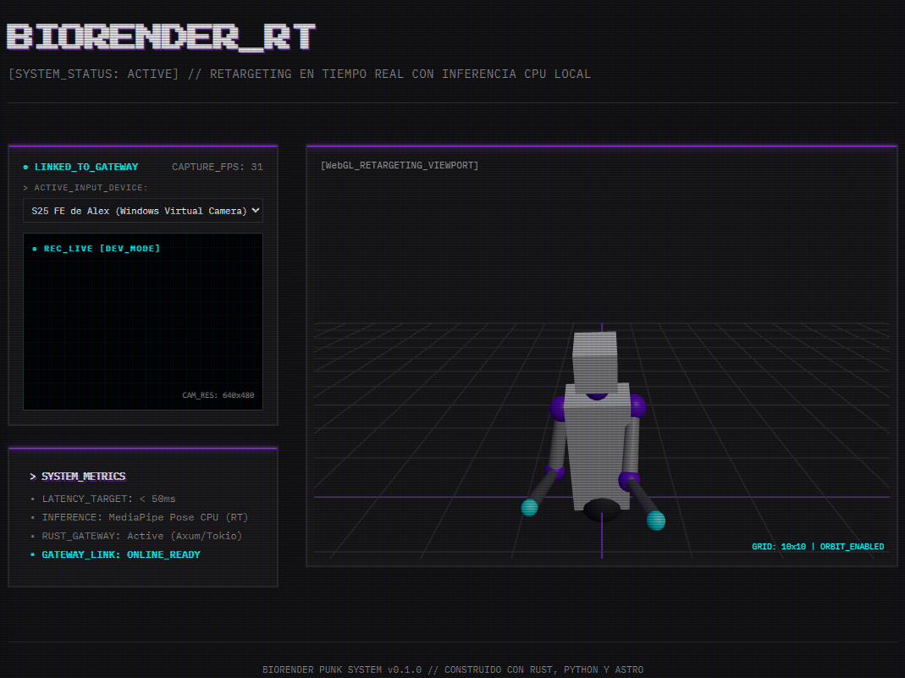

# BioRender - Real-Time Motion Capture & 3D Humanoid Retargeting

**BioRender** es un motor ligero y de alto rendimiento para captura de movimiento en tiempo real (mocap) e ingesta de retargeting cinemático. Este prototipo inicial captura la transmisión de la cámara web o móvil del usuario a través del navegador, realiza la inferencia tridimensional de las landmarks anatómicas en CPU y aplica las rotaciones espaciales calculadas instantáneamente sobre un avatar humanoide procedimental en 3D.



---

## ⚡ Características Destacadas (MVP)

*   **Captura WebRTC Fluida:** Captura continua a 30 FPS desde el navegador con un selector interactivo ciberpunk de entradas de video que soporta webcams integradas, cámaras virtuales y teléfonos móviles sincronizados vía *Enlace a Windows / DroidCam*.
*   **Inferencia en CPU de Baja Latencia (< 8ms):** Pipeline de FastAPI en Python que decodifica frames Base64 JPEG y ejecuta MediaPipe Pose en CPU con complejidad optimizada, evitando la necesidad obligatoria de GPUs.
*   **Motor Cinemático Integrado (Rust):** API Gateway asíncrono construido sobre Axum y Tokio que actúa como WebSocket Hub y ejecuta cálculos de traducción angular a cuaterniones con la librería matemática nativa `glam`.
*   **Visualización Interactiva WebGL (R3F):** Visor en tiempo real en React Three Fiber con grilla interactiva, controles de órbita y un esqueleto humanoid jerárquico articulado procedimental.
*   **Estabilidad Extrema (Anti-Loops):** Manejo del ciclo de vida de WebSocket persistente en el frontend mediante `useRef` para evitar bucles infinitos de conexión, e implementación de un `ErrorBoundary` terminal retro de autodiagnóstico.

---

## 📐 Estructura del Proyecto

El repositorio está organizado como un monorepo simplificado:

```text
BioRender/
├── docker-compose.yml             # Orquestación de backend con límites cgroups
├── docs/
│   └── assets/BioRender.png       # Imagen del visualizador del sistema
├── gateway/                       # API Gateway y Orquestador de Retargeting (Rust)
│   ├── src/
│   │   ├── models/                # Estructuras JSON para WS e HTTP (Serde)
│   │   ├── retargeting/           # Mapeo matemático a glam::Quat con tests
│   │   ├── routes/                # WebSocket upgrade y handler asíncrono
│   │   └── main.rs                # Inicialización de Router y Estado Compartido
│   └── Dockerfile
├── services/
│   └── realtime/
│       └── ms_pose_rt/            # Servidor de Inferencia de landmarks (FastAPI)
│           ├── main.py            # API REST MediaPipe Pose
│           └── Dockerfile         # Optimización extrema CPU-only
└── frontend/                      # Interfaz interactiva "BioRender Punk" (Astro + R3F)
    ├── src/
    │   ├── components/react/      # BioRenderApp, LiveCamera y Viewer3D
    │   ├── hooks/                 # useWebSocket con auto-reconexión estable
    │   ├── styles/global.css      # Estilos ciberpunk dark-first
    │   └── pages/index.astro      # Punto de entrada de la landing page
```

---

## ⚡ Métricas de Optimización de Recursos

Hemos aplicado una ingeniería de empaquetado rigurosa logrando reducir drásticamente el peso y consumo de hardware en tu sistema host:

*   **Reducción del 63.4% en Imagen Docker:** Pre-instalando PyTorch CPU-only (`https://download.pytorch.org/whl/cpu`) antes de MediaPipe, evitamos la descarga automática del kit de CUDA de NVIDIA. **La imagen de Pose RT bajó de 6.39 GB a 2.34 GB**.
*   **Control Estricto de Memoria (Cgroups):** El Gateway de Rust está limitado a un máximo de **`256 MB`** de RAM y el servidor de Inferencia de Python a **`1.5 GB`** de RAM en [docker-compose.yml](docker-compose.yml).
*   **Optimización de Hilos:** Se inyectaron variables de entorno (`OMP_NUM_THREADS=1`, `MKL_NUM_THREADS=1`) para evitar la sobrecarga por hilos en CPU y el intercambio excesivo de contextos en el sistema operativo.

---

## 🛠️ Requisitos del Sistema

*   **Docker & Docker Compose** (Latest)
*   **Node.js** (v22.x o superior)
*   **PNPM** (v9.x/v11.x)
*   **Cámara web activa** (o teléfono móvil enlazado como dispositivo virtual de video)

---

## 🚀 Guía de Instalación y Ejecución

Sigue estos sencillos pasos para levantar y ejecutar el stack local de BioRender:

### 1. Levantar el Backend (Docker Compose)
Compila y ejecuta el API Gateway (Rust) y el microservicio de Inferencia (Python) en segundo plano:
```bash
docker compose up --build -d
```
> [!NOTE]
> Puedes realizar un sanity check a los endpoints de salud:
> *   Rust Gateway: [http://localhost:8080/health](http://localhost:8080/health) (Retorna: *BioRender Rust API Gateway - ACTIVO*)
> *   Python Pose API: [http://localhost:8001/health](http://localhost:8001/health) (Retorna: *status: ok*)

### 2. Levantar el Frontend (Astro Web App)
Instala las dependencias y corre el servidor de desarrollo de Astro en tu terminal local:
```bash
cd frontend
pnpm install
pnpm run dev
```

### 3. Ejecución en el Navegador
*   Accede en tu navegador a: **[http://localhost:4321/](http://localhost:4321/)**.
*   Concede permisos a la cámara web.
*   Si utilizas la cámara de tu celular, selecciona tu dispositivo en el selector retro **`> ACTIVE_INPUT_DEVICE:`** ubicado arriba del visor de cámara.
*   ¡Listo! Muévete y verás al avatar 3D imitar tus brazos en tiempo real.
