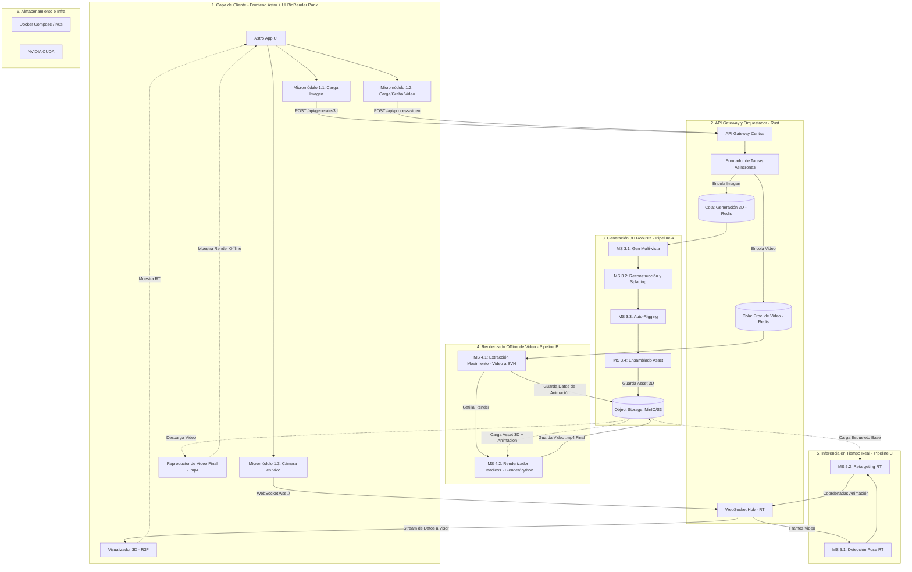
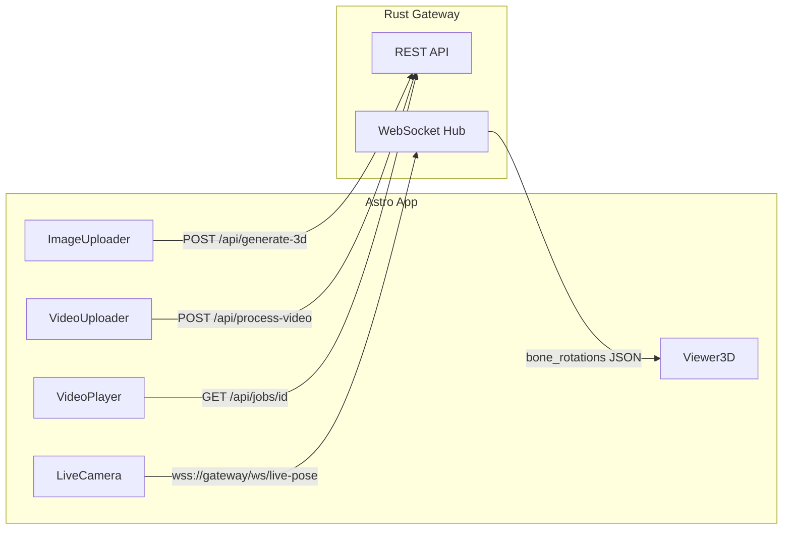
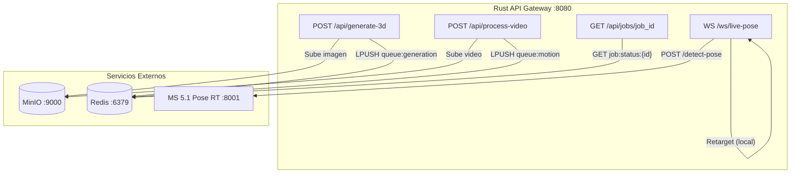
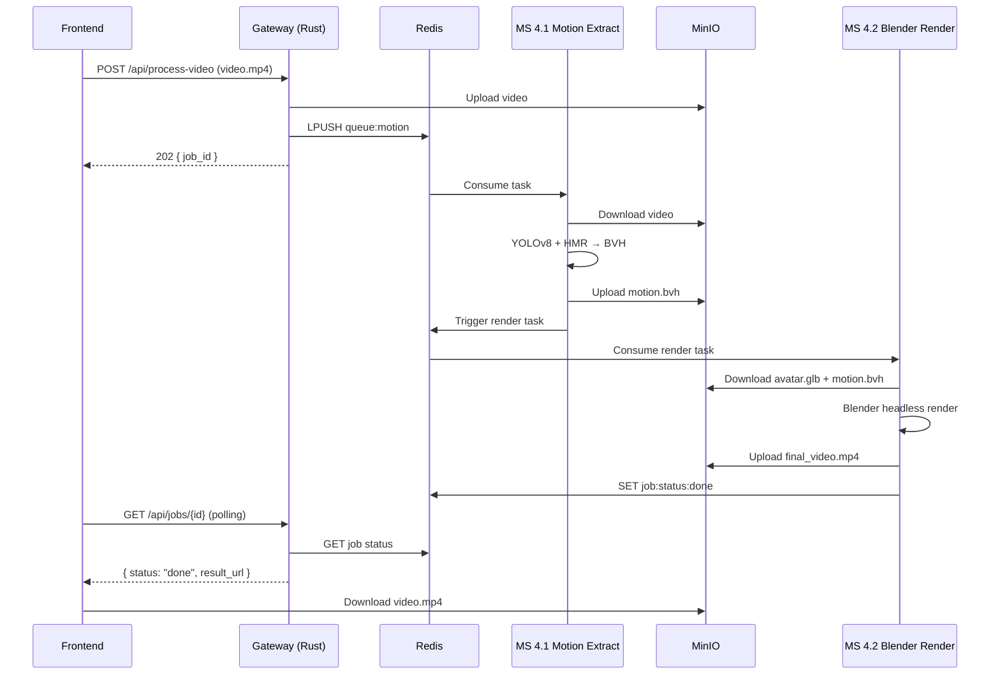
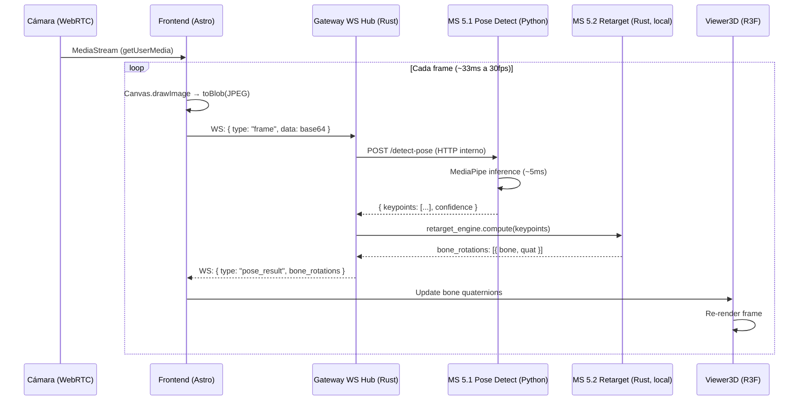

# 🧬 BioRender — Plan Técnico Maestro

> **Plataforma de síntesis de avatares 3D, captura de movimiento y retargeting de animación en tiempo real y offline.**

---

## 📋 Tabla de Contenidos

1. [Visión General del Sistema](#1-visión-general-del-sistema)
2. [Diagrama de Arquitectura](#2-diagrama-de-arquitectura)
3. [Topología de Red y Patrones de Diseño](#3-topología-de-red-y-patrones-de-diseño)
4. [Capa 1 — Frontend (Astro + UI BioRender Punk)](#4-capa-1--frontend-astro--ui-biorender-punk)
5. [Capa 2 — API Gateway & Orquestador (Rust / Axum)](#5-capa-2--api-gateway--orquestador-rust--axum)
6. [Capa 3 — Pipeline A: Generación 3D (Offline Asíncrono)](#6-capa-3--pipeline-a-generación-3d-offline-asíncrono)
7. [Capa 4 — Pipeline B: Renderizado Offline de Video](#7-capa-4--pipeline-b-renderizado-offline-de-video)
8. [Capa 5 — Pipeline C: Inferencia en Tiempo Real](#8-capa-5--pipeline-c-inferencia-en-tiempo-real)
9. [Capa 6 — Almacenamiento e Infraestructura](#9-capa-6--almacenamiento-e-infraestructura)
10. [Fases de Ejecución](#10-fases-de-ejecución)
11. [Reglas de Codificación](#11-reglas-de-codificación)

---

## 1. Visión General del Sistema

El proyecto **BioRender** es una plataforma orientada a microservicios para:

| Capacidad | Descripción |
|---|---|
| **Generación de Avatar 3D** | Convertir una imagen 2D en un asset 3D animable (`.glb`) con esqueleto |
| **Captura de Movimiento** | Extraer datos de movimiento humano desde video grabado, subido o cámara en vivo |
| **Retargeting de Animación** | Transferir los datos de movimiento capturado al avatar 3D generado |
| **Renderizado** | Generar video `.mp4` offline o visualización 3D en tiempo real |

### Stack Tecnológico Principal

| Capa | Tecnología |
|---|---|
| Frontend | **Astro** (SSG/SSR) + **React** (Islands) + **R3F** (React Three Fiber) + **TailwindCSS v4** |
| API Gateway | **Rust** con **Axum** + **Tokio** (runtime async) |
| Microservicios IA | **Python 3.10+** con **FastAPI** + **PyTorch** (CUDA 12.x) |
| Colas Asíncronas | **Redis** (Message Broker) + **Celery** (Workers) |
| Almacenamiento | **MinIO** (Object Storage compatible S3) |
| Retargeting RT | **Rust** con **nalgebra** / **glam** (matemáticas 3D) |
| Infraestructura | **Docker Compose** / **Kubernetes** + **NVIDIA CUDA 12.x** |

---

## 2. Diagrama de Arquitectura



---

## 3. Topología de Red y Patrones de Diseño

### 3.1 Patrón Arquitectónico

**Microservices con API Gateway centralizado.** Cada servicio es un contenedor Docker independiente con responsabilidad única.

### 3.2 Patrones de Comunicación

| Patrón | Uso | Tecnología |
|---|---|---|
| **REST (Síncrono)** | Subida de archivos, consultas de estado | Axum (Rust) ↔ FastAPI (Python) |
| **Productor-Consumidor (Asíncrono)** | Tareas pesadas de GPU | Redis + Celery Workers |
| **WebSocket (Tiempo Real)** | Streaming de cámara, retargeting de pose | Axum WebSocket Hub ↔ Browser |
| **Object Storage** | Persistencia de assets, modelos, videos | MinIO (API S3-compatible) |

### 3.3 Principios de Diseño

- **Stateless Services**: Todo estado persiste en MinIO/Redis. Escalamiento horizontal.
- **Separation of Concerns**: Cada microservicio tiene una sola responsabilidad (SRP).
- **GPU Isolation**: Tareas de GPU en contenedores dedicados con NVIDIA runtime.
- **Fail-Safe Queues**: Redis garantiza que ninguna tarea se pierda si un worker cae.

---

## 4. Capa 1 — Frontend (Astro + UI BioRender Punk)

### 4.1 Descripción General

Frontend **Astro** con arquitectura de **Islands**. Astro genera HTML estático por defecto y solo hidrata los componentes React interactivos usando `client:load` o `client:only="react"`.

### 4.2 Stack del Frontend

| Componente | Tecnología | Versión |
|---|---|---|
| Framework Base | Astro | 5.x (SSG/SSR) |
| UI Interactiva | React | 19.x (Islands via `client:load`) |
| Visualización 3D | React Three Fiber (R3F) | Latest + `@react-three/drei` |
| Estilos | TailwindCSS | v4 (con `@theme` directive) |
| Fuentes | Google Fonts | `IBM Plex Mono` + `Press Start 2P` |
| Captura de Medios | WebRTC | MediaStream API nativa |

### 4.3 Estructura de Directorios del Frontend

```
frontend/
├── astro.config.mjs
├── tailwind.config.ts
├── package.json
├── public/
│   ├── fonts/
│   └── models/              # Assets GLB estáticos de prueba
├── src/
│   ├── layouts/
│   │   └── Layout.astro     # Layout base con meta tags SEO
│   ├── pages/
│   │   └── index.astro      # Landing page principal
│   ├── components/
│   │   ├── astro/
│   │   │   ├── Header.astro
│   │   │   └── Footer.astro
│   │   └── react/
│   │       ├── ImageUploader.tsx        # Micromódulo 1.1
│   │       ├── VideoUploader.tsx        # Micromódulo 1.2
│   │       ├── LiveCamera.tsx           # Micromódulo 1.3
│   │       ├── Viewer3D.tsx             # Visualizador R3F
│   │       ├── VideoPlayer.tsx          # Reproductor .mp4
│   │       └── ControlPanel.tsx         # Panel de controles
│   ├── hooks/
│   │   ├── useWebSocket.ts
│   │   └── useApiClient.ts
│   ├── services/
│   │   ├── api.ts
│   │   └── websocket.ts
│   └── styles/
│       └── global.css
```

### 4.4 Diseño Visual — Estética "BioRender Punk"

#### 4.4.1 Sistema de Diseño (CSS Global)

```css
/* src/styles/global.css */
@import url('https://fonts.googleapis.com/css2?family=IBM+Plex+Mono:wght@400;600;700&family=Press+Start+2P&display=swap');

@theme {
  --font-mono: "IBM Plex Mono", ui-monospace, monospace;
  --font-display: "press-start-2p", ui-monospace, monospace;
  --color-zag-dark: var(--color-neutral-900);
  --color-zag-light: var(--color-neutral-100);
}

@layer base {
  .zag-bg    { background-color: var(--color-zag-dark); }
  .zag-text  { color: var(--color-zag-light); }
  .zag-border { border-color: var(--color-zag-light); border-width: 2px; border-style: solid; }
}
```

#### 4.4.2 Reglas de Diseño

| Regla | Detalle |
|---|---|
| **Modo** | Dark-first (`#171717` fondo, `#F5F5F5` texto) |
| **Bordes** | Rígidos, 2px solid, sin border-radius excesivo |
| **Sombras** | Prohibidas — sin `box-shadow`, sin degradados |
| **Hover** | `transition-colors hover:bg-neutral-100 hover:text-neutral-900` |
| **Cursor** | Animación `pulse` parpadeante en el título |
| **Tipografía** | `Press Start 2P` headings, `IBM Plex Mono` body |

#### 4.4.3 Layout de la Landing Page

```
┌─────────────────────────────────────────────────────────┐
│  HEADER                                                 │
│  ┌──────────────────────┐   ┌──────┐ ┌───────────────┐  │
│  │ BioRender█           │   │  ↑   │ │ carga tu puta │  │
│  │ "Haz tu sueño..."    │   │upload│ │    imagen     │  │
│  └──────────────────────┘   └──────┘ └───────────────┘  │
├─────────────────────────────────────────────────────────┤
│  MAIN GRID (lg:grid-cols-3)                             │
│  ┌────────────────────────────┐ ┌─────────────────────┐ │
│  │                            │ │  ┌─────┐ ┌────────┐ │ │
│  │     VISOR PRINCIPAL        │ │  │grabar│ │en tiem-│ │ │
│  │     (col-span-2)           │ │  │video │ │po real │ │ │
│  │     aspect-video           │ │  └─────┘ └────────┘ │ │
│  │                            │ ├─────────────────────┤ │
│  │     "HUMAN ACTOR"          │ │   VISOR SECUNDARIO  │ │
│  │                            │ │   (Avatar 3D)       │ │
│  │                            │ │     "ACTOR"         │ │
│  └────────────────────────────┘ └─────────────────────┘ │
└─────────────────────────────────────────────────────────┘
```

---

### 4.5 Micromódulo 1.1 — Carga de Imagen (`ImageUploader.tsx`)

**Responsabilidad:** Subir imagen (PNG/JPG/WEBP) para el **Pipeline A** de generación 3D.

**Flujo de Datos:**
```
Usuario → Selecciona imagen → FileReader API → Preview en UI
       → POST /api/generate-3d (multipart/form-data)
       → Gateway Rust → Cola Redis (Queue_Generation)
       → Respuesta: { job_id, status: "queued" }
```

**API Contract:**

| Campo | Detalle |
|---|---|
| **Endpoint** | `POST /api/generate-3d` |
| **Content-Type** | `multipart/form-data` |
| **Body** | `image: File` (max 10MB, PNG/JPG/WEBP) |
| **Response 202** | `{ "job_id": "uuid", "status": "queued", "estimated_time": 120 }` |
| **Response 400** | `{ "error": "invalid_format", "message": "..." }` |

**Implementación Clave:**

```tsx
// src/components/react/ImageUploader.tsx
import { useState, useCallback } from 'react';

interface UploadResponse {
  job_id: string;
  status: 'queued' | 'processing' | 'done' | 'error';
  estimated_time: number;
}

export default function ImageUploader() {
  const [preview, setPreview] = useState<string | null>(null);
  const [uploading, setUploading] = useState(false);
  const [jobId, setJobId] = useState<string | null>(null);

  const handleFile = useCallback((file: File) => {
    const reader = new FileReader();
    reader.onload = (e) => setPreview(e.target?.result as string);
    reader.readAsDataURL(file);
  }, []);

  const handleUpload = async (file: File) => {
    setUploading(true);
    const formData = new FormData();
    formData.append('image', file);
    const res = await fetch('/api/generate-3d', { method: 'POST', body: formData });
    const data: UploadResponse = await res.json();
    setJobId(data.job_id);
    setUploading(false);
  };

  return (/* UI: drag-and-drop + preview + botón submit */);
}
```

**Integración Astro:** `<ImageUploader client:load />`

> Se usa `client:load` porque el componente debe ser interactivo inmediatamente al cargar la página.

---

### 4.6 Micromódulo 1.2 — Carga/Grabación de Video (`VideoUploader.tsx`)

**Responsabilidad:** Subir video existente o grabar desde el navegador para el **Pipeline B**.

**Flujo de Datos:**
```
Usuario → Sube video .mp4/.webm  ──┐
          ó                         ├→ POST /api/process-video (multipart)
          Graba con MediaRecorder ──┘   → Gateway → Cola Redis (Queue_Motion)
```

**API Contract:**

| Campo | Detalle |
|---|---|
| **Endpoint** | `POST /api/process-video` |
| **Content-Type** | `multipart/form-data` |
| **Body** | `video: File` (max 100MB, MP4/WEBM), `asset_id?: string` |
| **Response 202** | `{ "job_id": "uuid", "status": "queued" }` |

**Grabación con MediaRecorder:**

```tsx
const startRecording = async () => {
  const stream = await navigator.mediaDevices.getUserMedia({
    video: { width: 1280, height: 720, facingMode: 'user' }, audio: false
  });
  const recorder = new MediaRecorder(stream, { mimeType: 'video/webm;codecs=vp9' });
  const chunks: BlobPart[] = [];
  recorder.ondataavailable = (e) => chunks.push(e.data);
  recorder.onstop = () => {
    const blob = new Blob(chunks, { type: 'video/webm' });
    uploadVideo(new File([blob], 'recording.webm', { type: 'video/webm' }));
  };
  recorder.start();
};
```

---

### 4.7 Micromódulo 1.3 — Cámara en Vivo (`LiveCamera.tsx`)

**Responsabilidad:** Capturar frames de cámara en tiempo real via **WebRTC** y enviarlos al **Pipeline C** por **WebSocket**.

**Flujo de Datos:**
```
Cámara → getUserMedia() → <video> → Canvas.drawImage()
       → canvas.toBlob() (JPEG ~30KB/frame)
       → WebSocket wss://gateway/ws/live-pose
       → Gateway → MS 5.1 (Pose) → MS 5.2 (Retarget)
       → WebSocket ← { bone_rotations: [...] }
       → Viewer3D (R3F) aplica rotaciones
```

**WebSocket Protocol:**

```typescript
// Cliente → Servidor
interface FrameMessage {
  type: 'frame';
  data: string;          // base64 JPEG
  timestamp: number;
  frame_id: number;
}

// Servidor → Cliente
interface PoseResultMessage {
  type: 'pose_result';
  frame_id: number;
  bone_rotations: {
    bone_name: string;
    quaternion: [number, number, number, number]; // [x, y, z, w]
  }[];
  confidence: number;
}
```

**Hook WebSocket:**

```typescript
// src/hooks/useWebSocket.ts
export function useWebSocket({ url, onMessage, reconnectInterval = 3000 }) {
  const wsRef = useRef<WebSocket | null>(null);
  const [connected, setConnected] = useState(false);

  const connect = useCallback(() => {
    const ws = new WebSocket(url);
    ws.onopen = () => setConnected(true);
    ws.onclose = () => { setConnected(false); setTimeout(connect, reconnectInterval); };
    ws.onmessage = (e) => onMessage(JSON.parse(e.data));
    wsRef.current = ws;
  }, [url, onMessage, reconnectInterval]);

  const sendFrame = useCallback((frameData: string, frameId: number) => {
    if (wsRef.current?.readyState === WebSocket.OPEN) {
      wsRef.current.send(JSON.stringify({ type: 'frame', data: frameData, timestamp: Date.now(), frame_id: frameId }));
    }
  }, []);

  useEffect(() => { connect(); return () => wsRef.current?.close(); }, [connect]);
  return { connected, sendFrame };
}
```

---

### 4.8 Visualizador 3D (`Viewer3D.tsx`)

**Responsabilidad:** Renderizar asset `.glb` y aplicar rotaciones de huesos en tiempo real desde Pipeline C.

```tsx
// src/components/react/Viewer3D.tsx
import { Canvas } from '@react-three/fiber';
import { OrbitControls, useGLTF } from '@react-three/drei';
import { Suspense, useRef, useEffect } from 'react';
import * as THREE from 'three';

function AnimatedModel({ url, boneRotations }) {
  const { scene } = useGLTF(url);
  const bonesRef = useRef(new Map());

  useEffect(() => {
    scene.traverse((child) => {
      if (child.isBone) bonesRef.current.set(child.name, child);
    });
  }, [scene]);

  useEffect(() => {
    if (!boneRotations) return;
    for (const { bone_name, quaternion } of boneRotations) {
      const bone = bonesRef.current.get(bone_name);
      if (bone) bone.quaternion.set(...quaternion);
    }
  }, [boneRotations]);

  return <primitive object={scene} />;
}

export default function Viewer3D({ modelUrl, boneRotations }) {
  return (
    <Canvas camera={{ position: [0, 1.5, 3], fov: 50 }}>
      <ambientLight intensity={0.6} />
      <directionalLight position={[5, 5, 5]} intensity={0.8} />
      <Suspense fallback={null}>
        <AnimatedModel url={modelUrl} boneRotations={boneRotations} />
      </Suspense>
      <OrbitControls />
    </Canvas>
  );
}
```

**Integración Astro:** `<Viewer3D client:only="react" modelUrl="/models/avatar.glb" />`

> Se usa `client:only="react"` porque Three.js/R3F depende de WebGL, que no existe en el servidor.

---

### 4.9 Reproductor de Video (`VideoPlayer.tsx`)

**Responsabilidad:** Reproducir el `.mp4` final renderizado por Pipeline B desde MinIO.

**Flujo:**
```
Pipeline B completa → MinIO guarda .mp4
→ Cliente polling: GET /api/jobs/{job_id}
→ { "status": "done", "result_url": "https://minio/bucket/video.mp4" }
→ <video> carga la URL
```

| Campo | Detalle |
|---|---|
| **Endpoint** | `GET /api/jobs/{job_id}` |
| **Response (processing)** | `{ "status": "processing", "progress": 65 }` |
| **Response (done)** | `{ "status": "done", "result_url": "https://..." }` |
| **Polling** | Cada 3 segundos |

---

### 4.10 Mapa de Conexiones Frontend → Gateway



---

## 5. Capa 2 — API Gateway & Orquestador (Rust / Axum)

### 5.1 Descripción General

El **API Gateway** es el único punto de entrada para el cliente. Escrito en **Rust** con **Axum** + **Tokio**, maneja:

- **Endpoints REST** para subida de archivos y consulta de estado de jobs
- **WebSocket Hub** para streaming en tiempo real (Pipeline C)
- **Encolamiento** de tareas asíncronas hacia Redis
- **Proxy inverso** de respuestas desde microservicios Python

### 5.2 Stack del Gateway

| Componente | Crate / Tecnología |
|---|---|
| Framework HTTP | `axum` 0.8+ con `tokio` runtime |
| WebSocket | `axum::extract::ws::WebSocketUpgrade` |
| Redis Client | `redis` crate (async con `tokio`) |
| S3/MinIO Client | `aws-sdk-s3` o `rusoto_s3` |
| Serialización | `serde` + `serde_json` |
| Validación | `validator` crate |
| Logging | `tracing` + `tracing-subscriber` |
| CORS | `tower-http::cors` |
| Multipart | `axum::extract::Multipart` |

### 5.3 Estructura de Directorios del Gateway

```
gateway/
├── Cargo.toml
├── Dockerfile
├── .env
├── src/
│   ├── main.rs              # Punto de entrada, configura Router
│   ├── config.rs            # Variables de entorno, configuración
│   ├── routes/
│   │   ├── mod.rs
│   │   ├── generate_3d.rs   # POST /api/generate-3d
│   │   ├── process_video.rs # POST /api/process-video
│   │   ├── jobs.rs          # GET /api/jobs/{job_id}
│   │   └── ws_live.rs       # WebSocket /ws/live-pose
│   ├── services/
│   │   ├── mod.rs
│   │   ├── redis_queue.rs   # Productor: encola tareas
│   │   ├── minio_client.rs  # Subida/descarga de assets
│   │   └── job_tracker.rs   # Estado de jobs en Redis
│   ├── models/
│   │   ├── mod.rs
│   │   ├── job.rs           # Job struct + estados
│   │   └── ws_messages.rs   # Tipos de mensajes WS
│   ├── middleware/
│   │   ├── mod.rs
│   │   └── cors.rs          # Configuración CORS
│   └── errors.rs            # Manejo global de errores
```

### 5.4 Endpoints REST

#### 5.4.1 `POST /api/generate-3d`

Recibe una imagen, la sube a MinIO y encola la tarea de generación 3D.

```rust
// src/routes/generate_3d.rs
use axum::{extract::Multipart, Json, http::StatusCode};
use serde::Serialize;
use uuid::Uuid;

#[derive(Serialize)]
pub struct GenerateResponse {
    job_id: String,
    status: String,
    estimated_time: u32,
}

pub async fn generate_3d_handler(
    mut multipart: Multipart,
) -> Result<(StatusCode, Json<GenerateResponse>), AppError> {
    // 1. Extraer imagen del multipart
    let field = multipart.next_field().await?.ok_or(AppError::MissingField)?;
    let data = field.bytes().await?;
    
    // 2. Validar formato (PNG/JPG/WEBP, max 10MB)
    validate_image(&data)?;
    
    // 3. Generar job_id único
    let job_id = Uuid::new_v4().to_string();
    
    // 4. Subir imagen a MinIO: bucket "uploads", key "{job_id}/input.png"
    minio_client.upload(&format!("{}/input.png", job_id), &data).await?;
    
    // 5. Encolar tarea en Redis (cola "queue:generation")
    redis_queue.enqueue("queue:generation", &json!({
        "job_id": &job_id,
        "image_key": format!("{}/input.png", job_id),
        "created_at": chrono::Utc::now().to_rfc3339(),
    })).await?;
    
    // 6. Registrar estado inicial del job
    job_tracker.set_status(&job_id, "queued").await?;
    
    Ok((StatusCode::ACCEPTED, Json(GenerateResponse {
        job_id,
        status: "queued".into(),
        estimated_time: 120,
    })))
}
```

#### 5.4.2 `POST /api/process-video`

Recibe un video, lo sube a MinIO y encola la tarea de extracción de movimiento.

```rust
// src/routes/process_video.rs
pub async fn process_video_handler(
    mut multipart: Multipart,
) -> Result<(StatusCode, Json<ProcessResponse>), AppError> {
    let field = multipart.next_field().await?.ok_or(AppError::MissingField)?;
    let data = field.bytes().await?;
    
    validate_video(&data)?; // MP4/WEBM, max 100MB
    
    let job_id = Uuid::new_v4().to_string();
    minio_client.upload(&format!("{}/input_video.mp4", job_id), &data).await?;
    
    redis_queue.enqueue("queue:motion", &json!({
        "job_id": &job_id,
        "video_key": format!("{}/input_video.mp4", job_id),
        "asset_id": asset_id, // Opcional: ID del asset 3D ya generado
    })).await?;
    
    job_tracker.set_status(&job_id, "queued").await?;
    
    Ok((StatusCode::ACCEPTED, Json(ProcessResponse {
        job_id, status: "queued".into(),
    })))
}
```

#### 5.4.3 `GET /api/jobs/{job_id}`

Consulta el estado de un job (polling desde el frontend).

```rust
// src/routes/jobs.rs
#[derive(Serialize)]
pub struct JobStatus {
    job_id: String,
    status: String,        // "queued" | "processing" | "done" | "error"
    progress: Option<u8>,  // 0-100
    result_url: Option<String>,
    error_message: Option<String>,
}

pub async fn get_job_status(
    Path(job_id): Path<String>,
) -> Result<Json<JobStatus>, AppError> {
    let status = job_tracker.get_status(&job_id).await?;
    Ok(Json(status))
}
```

### 5.5 WebSocket Hub (`/ws/live-pose`)

El WebSocket Hub gestiona conexiones bidireccionales para el flujo en tiempo real:

```
Browser (frames) → Gateway WS Hub → MS 5.1 Python (Pose Detection)
                                   → MS 5.2 Rust (Retargeting)
                 ← Gateway WS Hub ← rotaciones de huesos
```

```rust
// src/routes/ws_live.rs
use axum::extract::ws::{WebSocketUpgrade, WebSocket, Message};
use axum::response::Response;

pub async fn ws_live_handler(ws: WebSocketUpgrade) -> Response {
    ws.on_upgrade(handle_socket)
}

async fn handle_socket(mut socket: WebSocket) {
    // 1. Cargar esqueleto base del asset desde MinIO (o cache)
    let skeleton = load_skeleton_from_cache().await;
    
    while let Some(Ok(msg)) = socket.recv().await {
        match msg {
            Message::Text(text) => {
                let frame_msg: FrameMessage = serde_json::from_str(&text).unwrap();
                
                // 2. Enviar frame a MS 5.1 (Pose Detection) via HTTP interno
                let keypoints = pose_service
                    .detect(&frame_msg.data)
                    .await
                    .unwrap();
                
                // 3. Calcular retargeting localmente (MS 5.2 en Rust)
                let bone_rotations = retarget_engine
                    .compute(&keypoints, &skeleton);
                
                // 4. Enviar resultado al cliente
                let response = PoseResultMessage {
                    type_: "pose_result".into(),
                    frame_id: frame_msg.frame_id,
                    bone_rotations,
                    confidence: keypoints.confidence,
                };
                socket.send(Message::Text(
                    serde_json::to_string(&response).unwrap()
                )).await.ok();
            }
            Message::Close(_) => break,
            _ => {}
        }
    }
}
```

### 5.6 Servicio Redis Queue (Productor)

```rust
// src/services/redis_queue.rs
use redis::AsyncCommands;

pub struct RedisQueue {
    client: redis::Client,
}

impl RedisQueue {
    pub async fn new(url: &str) -> Result<Self, redis::RedisError> {
        let client = redis::Client::open(url)?;
        Ok(Self { client })
    }
    
    /// Encola un mensaje JSON en la cola especificada (LPUSH)
    pub async fn enqueue(&self, queue_name: &str, payload: &serde_json::Value) 
        -> Result<(), redis::RedisError> 
    {
        let mut conn = self.client.get_multiplexed_async_connection().await?;
        let serialized = serde_json::to_string(payload).unwrap();
        conn.lpush(queue_name, serialized).await?;
        Ok(())
    }
}
```

### 5.7 Servicio MinIO Client

```rust
// src/services/minio_client.rs
use aws_sdk_s3::Client as S3Client;

pub struct MinioClient {
    client: S3Client,
    bucket: String,
}

impl MinioClient {
    pub async fn upload(&self, key: &str, data: &[u8]) -> Result<(), S3Error> {
        self.client
            .put_object()
            .bucket(&self.bucket)
            .key(key)
            .body(data.into())
            .send()
            .await?;
        Ok(())
    }
    
    pub async fn get_presigned_url(&self, key: &str) -> Result<String, S3Error> {
        // Genera URL temporal para descarga directa desde el frontend
        // Expiración: 1 hora
        todo!("Implementar presigned URL con aws-sdk-s3")
    }
}
```

### 5.8 Router Principal (main.rs)

```rust
// src/main.rs
use axum::{Router, routing::{post, get, any}, middleware};
use tower_http::cors::CorsLayer;

#[tokio::main]
async fn main() {
    tracing_subscriber::init();
    
    let config = Config::from_env();
    let redis_queue = RedisQueue::new(&config.redis_url).await.unwrap();
    let minio = MinioClient::new(&config.minio_url, &config.minio_bucket).await;
    let job_tracker = JobTracker::new(&config.redis_url).await.unwrap();
    
    let app_state = AppState { redis_queue, minio, job_tracker };
    
    let app = Router::new()
        // REST Endpoints
        .route("/api/generate-3d", post(generate_3d_handler))
        .route("/api/process-video", post(process_video_handler))
        .route("/api/jobs/{job_id}", get(get_job_status))
        // WebSocket
        .route("/ws/live-pose", any(ws_live_handler))
        // Middleware
        .layer(CorsLayer::permissive())
        .with_state(app_state);
    
    let listener = tokio::net::TcpListener::bind("0.0.0.0:8080").await.unwrap();
    tracing::info!("Gateway listening on :8080");
    axum::serve(listener, app).await.unwrap();
}
```

### 5.9 Diagrama de Conexiones del Gateway



---

## 6. Capa 3 — Pipeline A: Generación 3D (Offline Asíncrono)

### 6.1 Descripción General

Pipeline que convierte una **imagen 2D** en un **asset 3D animable** (`.glb`) con esqueleto y texturas. Es completamente asíncrono — los workers Celery procesan tareas de la cola Redis.

**Flujo completo:**
```
Cola Redis (queue:generation) → MS 3.1 (Multi-vista) → MS 3.2 (Reconstrucción 3D)
                              → MS 3.3 (Auto-Rigging) → MS 3.4 (Ensamblado Asset)
                              → MinIO (asset.glb guardado)
```

### 6.2 Stack del Pipeline A

| Componente | Tecnología |
|---|---|
| Workers | **Celery** con backend Redis |
| Framework API | **FastAPI** (para health checks y API interna) |
| Deep Learning | **PyTorch** 2.x con **CUDA 12.x** |
| Imagen base Docker | `nvidia/cuda:12.4.0-cudnn9-devel-ubuntu22.04` |
| Tipado | **Pydantic** v2 para validación de datos |

### 6.3 MS 3.1 — Generación Multi-vista

#### Responsabilidad
Generar múltiples vistas (6-8 ángulos) de un objeto/personaje a partir de una sola imagen de entrada usando modelos de difusión.

#### Modelos de Referencia
- **Zero123++** — Generación multi-vista condicionada por imagen
- **Stable Zero123** — Variante de Stable Diffusion para generación 3D
- **SV3D** (Stability AI) — Síntesis de vistas 3D desde imagen única

#### Flujo Interno

```
Imagen (MinIO) → Preprocesamiento (resize, normalize)
               → Modelo Zero123++ (inferencia GPU)
               → 6-8 imágenes multi-vista
               → Guardar en MinIO: {job_id}/multiview/view_{0-7}.png
```

#### Implementación

```python
# services/generation_3d/ms_multiview/worker.py
from celery import Celery
from pydantic import BaseModel
import torch
from diffusers import StableDiffusionPipeline  # O modelo específico

app = Celery('multiview', broker='redis://redis:6379/0')

class MultiviewTask(BaseModel):
    job_id: str
    image_key: str  # Clave en MinIO

class MultiviewResult(BaseModel):
    job_id: str
    view_keys: list[str]  # Claves de vistas en MinIO
    num_views: int

@app.task(bind=True, max_retries=3, default_retry_delay=30)
def generate_multiview(self, task_data: dict) -> dict:
    task = MultiviewTask(**task_data)
    
    # 1. Descargar imagen de MinIO
    image = minio_client.download(task.image_key)
    
    # 2. Preprocesar
    image_tensor = preprocess(image, target_size=(256, 256))
    
    # 3. Inferencia multi-vista
    with torch.no_grad():
        views = multiview_model.generate(
            image_tensor,
            num_views=8,
            elevation_angles=[0, 30, -30, 0, 0, 30, -30, 0],
            azimuth_angles=[0, 45, 90, 135, 180, 225, 270, 315],
        )
    
    # 4. Guardar cada vista en MinIO
    view_keys = []
    for i, view in enumerate(views):
        key = f"{task.job_id}/multiview/view_{i}.png"
        minio_client.upload(key, view)
        view_keys.append(key)
    
    # 5. Actualizar estado del job
    update_job_status(task.job_id, "multiview_done", progress=25)
    
    # 6. Encadenar con siguiente microservicio
    reconstruct_3d.delay({
        "job_id": task.job_id,
        "view_keys": view_keys,
    })
    
    return MultiviewResult(
        job_id=task.job_id,
        view_keys=view_keys,
        num_views=len(views),
    ).model_dump()
```

#### Configuración Docker

```dockerfile
# services/generation_3d/ms_multiview/Dockerfile
FROM nvidia/cuda:12.4.0-cudnn9-devel-ubuntu22.04

RUN apt-get update && apt-get install -y python3.10 python3-pip
COPY requirements.txt .
RUN pip install -r requirements.txt
COPY . /app
WORKDIR /app

CMD ["celery", "-A", "worker", "worker", "--loglevel=info", "-Q", "queue:generation", "--concurrency=1"]
```

---

### 6.4 MS 3.2 — Reconstrucción y Splatting

#### Responsabilidad
Reconstruir geometría 3D a partir de las múltiples vistas generadas, produciendo una malla con texturas.

#### Técnicas
- **3D Gaussian Splatting** (`gsplat`) — Reconstrucción rápida y de alta calidad
- **NeRF** (Neural Radiance Fields) — Alternativa más madura
- **InstantMesh** / **LGM** — Modelos end-to-end de imagen a malla

#### Flujo Interno

```
Vistas multi-ángulo (MinIO) → Estimación de cámaras
                             → Entrenamiento/Inferencia Gaussians
                             → Extracción de malla (Marching Cubes)
                             → Texturización UV
                             → Guardar: {job_id}/mesh/model.obj + texture.png
```

#### Implementación

```python
# services/generation_3d/ms_reconstruction/worker.py
@app.task(bind=True, max_retries=2)
def reconstruct_3d(self, task_data: dict) -> dict:
    task = ReconstructionTask(**task_data)
    
    # 1. Descargar vistas de MinIO
    views = [minio_client.download(key) for key in task.view_keys]
    
    # 2. Estimar poses de cámara para cada vista
    camera_poses = estimate_cameras(views, num_views=len(views))
    
    # 3. Reconstrucción 3D Gaussian Splatting
    gaussians = train_gaussians(
        images=views,
        cameras=camera_poses,
        num_iterations=3000,
        sh_degree=3,
    )
    
    # 4. Extraer malla via Marching Cubes
    mesh = extract_mesh_from_gaussians(
        gaussians,
        resolution=256,
        threshold=0.5,
    )
    
    # 5. Generar UV mapping y textura
    textured_mesh = generate_uv_and_bake_texture(mesh, views, camera_poses)
    
    # 6. Guardar en MinIO
    mesh_key = f"{task.job_id}/mesh/model.obj"
    texture_key = f"{task.job_id}/mesh/texture.png"
    minio_client.upload(mesh_key, textured_mesh.obj_bytes)
    minio_client.upload(texture_key, textured_mesh.texture_bytes)
    
    update_job_status(task.job_id, "reconstruction_done", progress=50)
    
    # 7. Encadenar con Auto-Rigging
    auto_rig.delay({
        "job_id": task.job_id,
        "mesh_key": mesh_key,
        "texture_key": texture_key,
    })
    
    return {"job_id": task.job_id, "mesh_key": mesh_key}
```

---

### 6.5 MS 3.3 — Auto-Rigging

#### Responsabilidad
Agregar un **esqueleto articulado** (armature) a la malla 3D para que pueda ser animada. Calcula las posiciones de los huesos y los pesos de influencia (skinning weights).

#### Técnicas
- **RigNet** — Auto-rigging basado en grafos neuronales
- **AccuRig** (Reallusion) — API de auto-rigging comercial
- **Mixamo** — Auto-rigging en la nube (Adobe)

#### Flujo Interno

```
Malla .obj (MinIO) → Análisis de geometría
                    → Predicción de posiciones de joints
                    → Generación de jerarquía de huesos
                    → Cálculo de skinning weights
                    → Exportar: {job_id}/rigged/model_rigged.fbx
```

#### Esqueleto Estándar (25 huesos)

```
Hips
├── Spine
│   ├── Spine1
│   │   ├── Spine2
│   │   │   ├── Neck → Head
│   │   │   ├── LeftShoulder → LeftArm → LeftForeArm → LeftHand
│   │   │   └── RightShoulder → RightArm → RightForeArm → RightHand
├── LeftUpLeg → LeftLeg → LeftFoot → LeftToeBase
└── RightUpLeg → RightLeg → RightFoot → RightToeBase
```

#### Implementación

```python
# services/generation_3d/ms_rigging/worker.py
@app.task(bind=True, max_retries=2)
def auto_rig(self, task_data: dict) -> dict:
    task = RiggingTask(**task_data)
    
    # 1. Descargar malla de MinIO
    mesh = load_mesh(minio_client.download(task.mesh_key))
    
    # 2. Predecir posiciones de joints
    joint_positions = rignet_model.predict_joints(mesh)
    
    # 3. Generar jerarquía de huesos
    skeleton = build_skeleton_hierarchy(
        joints=joint_positions,
        template="humanoid_25",  # Esqueleto estándar
    )
    
    # 4. Calcular skinning weights (Linear Blend Skinning)
    weights = compute_skinning_weights(
        mesh=mesh,
        skeleton=skeleton,
        method="geodesic_voxel",  # Más preciso que heat diffusion
    )
    
    # 5. Guardar en MinIO
    rigged_key = f"{task.job_id}/rigged/model_rigged.fbx"
    skeleton_json_key = f"{task.job_id}/rigged/skeleton.json"
    
    minio_client.upload(rigged_key, export_fbx(mesh, skeleton, weights))
    minio_client.upload(skeleton_json_key, skeleton.to_json())
    
    update_job_status(task.job_id, "rigging_done", progress=75)
    
    # 6. Encadenar con ensamblado final
    assemble_asset.delay({
        "job_id": task.job_id,
        "rigged_key": rigged_key,
        "texture_key": task.texture_key,
        "skeleton_json_key": skeleton_json_key,
    })
    
    return {"job_id": task.job_id, "rigged_key": rigged_key}
```

---

### 6.6 MS 3.4 — Ensamblado de Asset (Rust)

#### Responsabilidad
Empaquetar la malla texturizada y el esqueleto en un archivo **`.glb`** (GLTF binario) listo para visualización en R3F y animación.

#### Stack
- **Lenguaje:** Rust
- **Librería:** `gltf` crate para escritura de archivos GLTF/GLB
- **SDK MinIO:** `aws-sdk-s3`

#### Flujo Interno

```
Modelo rigged .fbx + texture.png + skeleton.json (MinIO)
    → Parsear FBX → Convertir a GLTF
    → Incrustar textura como buffer binario
    → Incrustar esqueleto como skin/joints
    → Exportar .glb compacto
    → Guardar: {job_id}/final/avatar.glb
```

#### Implementación

```rust
// services/generation_3d/ms_asset_assembly/src/main.rs
use gltf_json as json;

pub fn assemble_glb(
    mesh_data: &MeshData,
    texture_data: &[u8],
    skeleton: &SkeletonData,
) -> Vec<u8> {
    let mut root = json::Root::default();
    
    // 1. Crear buffer para geometría
    let mesh_buffer = create_mesh_buffer(&mesh_data);
    
    // 2. Crear buffer para textura
    let texture_buffer = create_texture_buffer(texture_data);
    
    // 3. Crear nodos de huesos (joints)
    let joint_nodes = skeleton.bones.iter().map(|bone| {
        json::Node {
            name: Some(bone.name.clone()),
            translation: Some(bone.position.into()),
            rotation: Some(bone.rotation.into()),
            children: Some(bone.children_indices.clone()),
            ..Default::default()
        }
    }).collect();
    
    // 4. Crear skin con joints y inverse bind matrices
    let skin = json::Skin {
        joints: (0..skeleton.bones.len()).collect(),
        inverse_bind_matrices: Some(create_ibm_accessor(&skeleton)),
        ..Default::default()
    };
    
    // 5. Ensamblar y serializar como GLB
    export_glb(&root)
}
```

#### Resultado Final

El asset `.glb` final contiene:
- **Geometría**: Malla con vértices, normales y UV coordinates
- **Material**: Textura PBR (baseColor, metallic, roughness)
- **Esqueleto**: Jerarquía de 25 huesos con inverse bind matrices
- **Skinning**: Pesos de influencia por vértice (max 4 influences)

---

## 7. Capa 4 — Pipeline B: Renderizado Offline de Video

### 7.1 Descripción General

Pipeline que extrae **movimiento humano** de un video y lo aplica al avatar 3D para generar un **video .mp4 animado** renderizado offline con Blender.

**Flujo completo:**
```
Cola Redis (queue:motion) → MS 4.1 (Extracción Movimiento)
                          → MinIO (animación.bvh)
                          → MS 4.2 (Blender Headless)
                          → MinIO (video_final.mp4) → Frontend (VideoPlayer)
```

### 7.2 MS 4.1 — Extracción de Movimiento (Video → BVH)

#### Responsabilidad
Extraer datos de pose 3D frame-by-frame de un video humano y exportarlos en formato **BVH** (Biovision Hierarchy) para animación.

#### Modelos de Referencia
- **VIBE** — Video Inference for Body Pose and Shape Estimation
- **4D Humans (HMR 2.0)** — State-of-the-art human mesh recovery
- **WHAM** — World-grounded Human Motion recovery

#### Flujo Interno

```
Video .mp4 (MinIO) → Decodificar frames (OpenCV)
                   → Detección de persona (YOLOv8)
                   → Estimación de pose 3D (SMPL params)
                   → Conversión SMPL → BVH
                   → Guardar: {job_id}/animation/motion.bvh
```

#### Implementación

```python
# services/video_render/ms_motion_extract/worker.py
from celery import Celery
from pydantic import BaseModel
import cv2
import torch
import numpy as np

app = Celery('motion_extract', broker='redis://redis:6379/0')

class MotionExtractionTask(BaseModel):
    job_id: str
    video_key: str
    asset_id: str | None = None  # Asset 3D destino (opcional)

@app.task(bind=True, max_retries=2)
def extract_motion(self, task_data: dict) -> dict:
    task = MotionExtractionTask(**task_data)
    
    # 1. Descargar video de MinIO
    video_bytes = minio_client.download(task.video_key)
    
    # 2. Decodificar frames
    frames = decode_video(video_bytes, target_fps=30)
    
    # 3. Para cada frame: detectar persona + estimar pose 3D
    all_poses: list[SMPLPose] = []
    for frame in frames:
        # Detección con YOLOv8
        bbox = yolo_detector.detect_person(frame)
        if bbox is None:
            all_poses.append(all_poses[-1] if all_poses else SMPLPose.default())
            continue
        
        # Crop y estimación de pose 3D
        cropped = crop_to_bbox(frame, bbox)
        smpl_params = hmr_model.predict(cropped)  # → θ (72), β (10), cam
        all_poses.append(smpl_params)
    
    # 4. Suavizar movimiento (filtro Savitzky-Golay)
    smoothed_poses = smooth_motion(all_poses, window=5)
    
    # 5. Convertir SMPL → BVH
    bvh_data = smpl_to_bvh(
        poses=smoothed_poses,
        fps=30,
        skeleton_template="humanoid_25",
    )
    
    # 6. Guardar en MinIO
    bvh_key = f"{task.job_id}/animation/motion.bvh"
    minio_client.upload(bvh_key, bvh_data)
    
    update_job_status(task.job_id, "motion_extracted", progress=50)
    
    # 7. Encadenar con renderizado headless
    render_video.delay({
        "job_id": task.job_id,
        "bvh_key": bvh_key,
        "asset_id": task.asset_id,
    })
    
    return {"job_id": task.job_id, "bvh_key": bvh_key}
```

---

### 7.3 MS 4.2 — Renderizador Headless (Blender)

#### Responsabilidad
Cargar el asset 3D (`.glb`) y la animación (`.bvh`) en **Blender headless**, aplicar la animación al avatar, y renderizar un video `.mp4`.

#### Stack
- **Blender** 4.x en modo headless (`blender --background`)
- **bpy** (Blender Python API) para scripting
- **Eevee** o **Cycles** para rendering
- Docker container dedicado con GPU

#### Flujo Interno

```
Asset .glb + Animación .bvh (MinIO)
    → Blender headless carga .glb
    → Importa .bvh como acción de animación
    → Retargeting de esqueleto BVH → esqueleto GLB
    → Configuración de cámara, iluminación, fondo
    → Render frame-by-frame → Encode .mp4 (FFmpeg)
    → Guardar: {job_id}/output/final_video.mp4
```

#### Script Blender (bpy)

```python
# services/video_render/ms_headless_render/render_script.py
import bpy
import sys
import json

def render_animation(config_path: str):
    with open(config_path) as f:
        config = json.load(f)
    
    # 1. Limpiar escena
    bpy.ops.wm.read_homefile(use_empty=True)
    
    # 2. Importar avatar .glb
    bpy.ops.import_scene.gltf(filepath=config["glb_path"])
    avatar = bpy.context.selected_objects[0]
    armature = avatar.find_armature()
    
    # 3. Importar animación .bvh
    bpy.ops.import_anim.bvh(
        filepath=config["bvh_path"],
        target='ARMATURE',
        global_scale=1.0,
    )
    bvh_armature = bpy.context.active_object
    
    # 4. Retarget: copiar rotaciones de BVH a avatar
    for bone_name in BONE_MAPPING:
        src = bvh_armature.pose.bones.get(BONE_MAPPING[bone_name])
        dst = armature.pose.bones.get(bone_name)
        if src and dst:
            constraint = dst.constraints.new('COPY_ROTATION')
            constraint.target = bvh_armature
            constraint.subtarget = src.name
    
    # 5. Bake animación
    bpy.ops.nla.bake(
        frame_start=1,
        frame_end=config["num_frames"],
        only_selected=False,
        visual_keying=True,
    )
    
    # 6. Configurar render
    scene = bpy.context.scene
    scene.render.engine = 'BLENDER_EEVEE_NEXT'  # Blender 4.x
    scene.render.resolution_x = 1920
    scene.render.resolution_y = 1080
    scene.render.fps = 30
    scene.frame_start = 1
    scene.frame_end = config["num_frames"]
    
    # Output como .mp4
    scene.render.image_settings.file_format = 'FFMPEG'
    scene.render.ffmpeg.format = 'MPEG4'
    scene.render.ffmpeg.codec = 'H264'
    scene.render.filepath = config["output_path"]
    
    # 7. Configurar cámara e iluminación
    setup_camera_and_lighting(avatar)
    
    # 8. Render!
    bpy.ops.render.render(animation=True)

if __name__ == "__main__":
    render_animation(sys.argv[-1])
```

#### Dockerfile de Blender

```dockerfile
# services/video_render/ms_headless_render/Dockerfile
FROM nvidia/cuda:12.4.0-cudnn9-runtime-ubuntu22.04

# Instalar Blender headless
RUN apt-get update && apt-get install -y wget xz-utils libxi6 libxxf86vm1 \
    && wget https://download.blender.org/release/Blender4.1/blender-4.1.0-linux-x64.tar.xz \
    && tar -xf blender-4.1.0-linux-x64.tar.xz -C /opt \
    && ln -s /opt/blender-4.1.0-linux-x64/blender /usr/local/bin/blender

COPY render_script.py /app/
COPY worker.py /app/
WORKDIR /app

CMD ["celery", "-A", "worker", "worker", "--loglevel=info", "-Q", "queue:render"]
```

### 7.4 Diagrama Pipeline B Completo



---

## 8. Capa 5 — Pipeline C: Inferencia en Tiempo Real

### 8.1 Descripción General

Pipeline de **ultra-baja latencia** (~16ms por frame) que detecta la pose humana desde la cámara en vivo y transfiere el movimiento al avatar 3D en tiempo real a través de WebSockets.

**Flujo completo:**
```
Browser (WebRTC) → Gateway WS Hub → MS 5.1 (Pose Detection, Python)
                                   → MS 5.2 (Retargeting, Rust)
                 ← Gateway WS Hub ← bone_rotations JSON
                 ← Viewer3D (R3F) ← Aplica rotaciones al esqueleto
```

### 8.2 MS 5.1 — Detección de Pose en Tiempo Real (Python)

#### Responsabilidad
Recibir frames de video y devolver **keypoints 2D/3D** de la pose humana detectada con latencia mínima.

#### Modelos

| Modelo | Latencia | Keypoints | GPU Req |
|---|---|---|---|
| **MediaPipe Pose** | ~5ms | 33 landmarks 3D | CPU/GPU |
| **YOLOv8-Pose** | ~8ms | 17 keypoints 2D | GPU |
| **RTMPose** (MMPose) | ~6ms | 17/133 keypoints | GPU |

**Recomendación:** Usar **MediaPipe** para prototipo (funciona sin GPU) y **YOLOv8-Pose** para producción.

#### API Interna

| Campo | Detalle |
|---|---|
| **Endpoint** | `POST /detect-pose` (HTTP interno, no expuesto) |
| **Content-Type** | `application/json` |
| **Body** | `{ "frame_data": "base64...", "frame_id": 123 }` |
| **Response** | `{ "keypoints": [...], "confidence": 0.95 }` |
| **Latencia target** | < 10ms |

#### Implementación

```python
# services/realtime/ms_pose_rt/main.py
from fastapi import FastAPI
from pydantic import BaseModel
import mediapipe as mp
import numpy as np
import base64
import cv2

app = FastAPI(title="Pose Detection RT", version="1.0")

# Inicializar modelo al arrancar (singleton)
mp_pose = mp.solutions.pose
pose_detector = mp_pose.Pose(
    static_image_mode=False,
    model_complexity=1,       # 0=lite, 1=full, 2=heavy
    min_detection_confidence=0.5,
    min_tracking_confidence=0.5,
)

class FrameInput(BaseModel):
    frame_data: str  # Base64 JPEG
    frame_id: int

class Keypoint(BaseModel):
    name: str
    x: float
    y: float
    z: float
    visibility: float

class PoseOutput(BaseModel):
    frame_id: int
    keypoints: list[Keypoint]
    confidence: float

# Mapeo de índices MediaPipe → nombres de hueso
LANDMARK_NAMES: dict[int, str] = {
    0: "nose", 11: "left_shoulder", 12: "right_shoulder",
    13: "left_elbow", 14: "right_elbow", 15: "left_wrist",
    16: "right_wrist", 23: "left_hip", 24: "right_hip",
    25: "left_knee", 26: "right_knee", 27: "left_ankle",
    28: "right_ankle",
}

@app.post("/detect-pose", response_model=PoseOutput)
async def detect_pose(frame: FrameInput) -> PoseOutput:
    # 1. Decodificar frame base64 → numpy array
    img_bytes = base64.b64decode(frame.frame_data)
    nparr = np.frombuffer(img_bytes, np.uint8)
    img = cv2.imdecode(nparr, cv2.IMREAD_COLOR)
    img_rgb = cv2.cvtColor(img, cv2.COLOR_BGR2RGB)
    
    # 2. Inferencia MediaPipe
    results = pose_detector.process(img_rgb)
    
    if not results.pose_world_landmarks:
        return PoseOutput(frame_id=frame.frame_id, keypoints=[], confidence=0.0)
    
    # 3. Extraer keypoints relevantes
    keypoints = []
    total_visibility = 0.0
    for idx, name in LANDMARK_NAMES.items():
        lm = results.pose_world_landmarks.landmark[idx]
        keypoints.append(Keypoint(
            name=name, x=lm.x, y=lm.y, z=lm.z, visibility=lm.visibility,
        ))
        total_visibility += lm.visibility
    
    confidence = total_visibility / len(LANDMARK_NAMES)
    
    return PoseOutput(
        frame_id=frame.frame_id,
        keypoints=keypoints,
        confidence=round(confidence, 3),
    )

@app.get("/health")
async def health():
    return {"status": "ok", "model": "mediapipe_pose"}
```

#### Dockerfile

```dockerfile
# services/realtime/ms_pose_rt/Dockerfile
FROM python:3.10-slim

RUN pip install fastapi uvicorn mediapipe opencv-python-headless numpy pydantic
COPY . /app
WORKDIR /app

EXPOSE 8001
CMD ["uvicorn", "main:app", "--host", "0.0.0.0", "--port", "8001", "--workers", "1"]
```

---

### 8.3 MS 5.2 — Retargeting en Tiempo Real (Rust)

#### Responsabilidad
Convertir los **keypoints de pose** (coordenadas 3D) en **rotaciones de huesos** (Cuaterniones) compatibles con el esqueleto del avatar 3D. Se ejecuta dentro del Gateway Rust como módulo interno.

#### Stack Matemático

| Operación | Librería |
|---|---|
| Vectores 3D | `glam::Vec3` |
| Cuaterniones | `glam::Quat` |
| Matrices 4x4 | `glam::Mat4` |
| Inverse Kinematics | Implementación custom |

#### Algoritmo de Retargeting

```
Para cada par de keypoints que definen un hueso:
  1. Calcular vector dirección del hueso: V = keypoint_child - keypoint_parent
  2. Normalizar: V_norm = V / |V|
  3. Calcular el vector de referencia (rest pose): V_ref
  4. Calcular rotación de V_ref → V_norm como Cuaternión:
     Q = Quat::from_rotation_arc(V_ref, V_norm)
  5. Convertir a espacio local del hueso padre:
     Q_local = Q_parent_inv * Q_world
```

#### Implementación

```rust
// services/realtime/ms_retarget_rt/src/retarget.rs
use glam::{Vec3, Quat};
use serde::{Serialize, Deserialize};

/// Mapeo de keypoints → pares de huesos
const BONE_PAIRS: &[(&str, &str, &str)] = &[
    // (bone_name, parent_keypoint, child_keypoint)
    ("LeftArm",     "left_shoulder", "left_elbow"),
    ("LeftForeArm", "left_elbow",    "left_wrist"),
    ("RightArm",    "right_shoulder","right_elbow"),
    ("RightForeArm","right_elbow",   "right_wrist"),
    ("LeftUpLeg",   "left_hip",      "left_knee"),
    ("LeftLeg",     "left_knee",     "left_ankle"),
    ("RightUpLeg",  "right_hip",     "right_knee"),
    ("RightLeg",    "right_knee",    "right_ankle"),
    ("Spine",       "left_hip",      "left_shoulder"),  // Aproximación
];

#[derive(Serialize, Deserialize, Clone)]
pub struct BoneRotation {
    pub bone_name: String,
    pub quaternion: [f32; 4],  // [x, y, z, w]
}

#[derive(Deserialize)]
pub struct Keypoint {
    pub name: String,
    pub x: f32,
    pub y: f32,
    pub z: f32,
    pub visibility: f32,
}

pub struct RetargetEngine {
    rest_pose: std::collections::HashMap<String, Vec3>,
}

impl RetargetEngine {
    /// Carga el esqueleto en rest pose desde el JSON del asset
    pub fn from_skeleton_json(json: &str) -> Self {
        let rest_pose = parse_rest_pose(json);
        Self { rest_pose }
    }
    
    /// Computa rotaciones de huesos a partir de keypoints
    pub fn compute(&self, keypoints: &[Keypoint]) -> Vec<BoneRotation> {
        let kp_map: std::collections::HashMap<&str, Vec3> = keypoints
            .iter()
            .map(|kp| (kp.name.as_str(), Vec3::new(kp.x, kp.y, kp.z)))
            .collect();
        
        let mut rotations = Vec::new();
        
        for &(bone_name, parent_kp, child_kp) in BONE_PAIRS {
            let Some(parent_pos) = kp_map.get(parent_kp) else { continue };
            let Some(child_pos) = kp_map.get(child_kp) else { continue };
            
            // Vector de dirección actual del hueso
            let direction = (*child_pos - *parent_pos).normalize();
            
            // Vector de referencia (rest pose — generalmente apuntando hacia abajo/adelante)
            let rest_dir = self.get_rest_direction(bone_name);
            
            // Cuaternión que rota rest_dir → direction
            let quat = Quat::from_rotation_arc(rest_dir, direction);
            
            rotations.push(BoneRotation {
                bone_name: bone_name.to_string(),
                quaternion: [quat.x, quat.y, quat.z, quat.w],
            });
        }
        
        rotations
    }
    
    fn get_rest_direction(&self, bone_name: &str) -> Vec3 {
        // Retorna la dirección del hueso en la pose de descanso
        self.rest_pose
            .get(bone_name)
            .copied()
            .unwrap_or(Vec3::Y) // Default: apuntando hacia arriba
    }
}
```

#### Documentación Matemática (Cuaterniones)

```
Cuaternión Q = (x, y, z, w) donde:
  - (x, y, z) = vector parte (eje de rotación × sin(θ/2))
  - w = cos(θ/2) (parte escalar)
  - |Q| = 1 (siempre normalizado)

from_rotation_arc(a, b):
  Calcula el cuaternión de rotación mínima que transforma
  el vector unitario 'a' en el vector unitario 'b'.
  
  half = normalize(a + b)
  Q.w = dot(a, half)
  Q.xyz = cross(a, half)
  
  Caso especial: Si a ≈ -b (180°), elegir eje perpendicular arbitrario.
```

### 8.4 Diagrama Pipeline C Completo



---

## 9. Capa 6 — Almacenamiento e Infraestructura

### 9.1 Object Storage (MinIO)

#### Configuración

| Parámetro | Valor |
|---|---|
| **Servicio** | MinIO (compatible S3) |
| **Puerto API** | 9000 |
| **Puerto Console** | 9001 |
| **Bucket principal** | `biorender-assets` |

#### Estructura de Buckets

```
biorender-assets/
├── {job_id}/
│   ├── input.png                    # Imagen original
│   ├── input_video.mp4              # Video original
│   ├── multiview/
│   │   ├── view_0.png ... view_7.png
│   ├── mesh/
│   │   ├── model.obj
│   │   └── texture.png
│   ├── rigged/
│   │   ├── model_rigged.fbx
│   │   └── skeleton.json
│   ├── final/
│   │   └── avatar.glb               # Asset 3D final
│   ├── animation/
│   │   └── motion.bvh               # Datos de animación
│   └── output/
│       └── final_video.mp4           # Video renderizado
```

### 9.2 Redis

| Parámetro | Valor |
|---|---|
| **Puerto** | 6379 |
| **Uso 1** | Message Broker (colas Celery) |
| **Uso 2** | Job Status Tracker (`job:status:{id}`) |
| **Uso 3** | Cache de esqueletos para RT |

#### Colas Redis

| Cola | Consumidor | Pipeline |
|---|---|---|
| `queue:generation` | MS 3.1 (Celery Worker) | Pipeline A |
| `queue:motion` | MS 4.1 (Celery Worker) | Pipeline B |
| `queue:render` | MS 4.2 (Celery Worker) | Pipeline B |

### 9.3 Docker Compose

```yaml
# docker-compose.yml
version: '3.8'

services:
  # ── Infraestructura ──
  redis:
    image: redis:7-alpine
    ports: ["6379:6379"]
    volumes: ["redis_data:/data"]

  minio:
    image: minio/minio:latest
    ports: ["9000:9000", "9001:9001"]
    environment:
      MINIO_ROOT_USER: ${MINIO_ROOT_USER:-biorender}
      MINIO_ROOT_PASSWORD: ${MINIO_ROOT_PASSWORD:-biorender123}
    command: server /data --console-address ":9001"
    volumes: ["minio_data:/data"]

  # ── Gateway ──
  gateway:
    build: ./gateway
    ports: ["8080:8080"]
    environment:
      REDIS_URL: redis://redis:6379
      MINIO_URL: http://minio:9000
      MINIO_BUCKET: biorender-assets
      POSE_SERVICE_URL: http://pose-rt:8001
    depends_on: [redis, minio]

  # ── Frontend ──
  frontend:
    build: ./frontend
    ports: ["4321:4321"]
    environment:
      PUBLIC_API_URL: http://gateway:8080
      PUBLIC_WS_URL: ws://gateway:8080

  # ── Pipeline C: Tiempo Real ──
  pose-rt:
    build: ./services/realtime/ms_pose_rt
    ports: ["8001:8001"]
    deploy:
      resources:
        reservations:
          devices:
            - driver: nvidia
              count: 1
              capabilities: [gpu]

  # ── Pipeline A: Generación 3D ──
  worker-multiview:
    build: ./services/generation_3d/ms_multiview
    environment:
      CELERY_BROKER_URL: redis://redis:6379/0
      MINIO_URL: http://minio:9000
    depends_on: [redis, minio]
    deploy:
      resources:
        reservations:
          devices:
            - driver: nvidia
              count: 1
              capabilities: [gpu]

  worker-reconstruction:
    build: ./services/generation_3d/ms_reconstruction
    environment:
      CELERY_BROKER_URL: redis://redis:6379/0
      MINIO_URL: http://minio:9000
    depends_on: [redis, minio]
    deploy:
      resources:
        reservations:
          devices:
            - driver: nvidia
              count: 1
              capabilities: [gpu]

  worker-rigging:
    build: ./services/generation_3d/ms_rigging
    environment:
      CELERY_BROKER_URL: redis://redis:6379/0
      MINIO_URL: http://minio:9000
    depends_on: [redis, minio]
    deploy:
      resources:
        reservations:
          devices:
            - driver: nvidia
              count: 1
              capabilities: [gpu]

  worker-assembly:
    build: ./services/generation_3d/ms_asset_assembly
    environment:
      REDIS_URL: redis://redis:6379
      MINIO_URL: http://minio:9000
    depends_on: [redis, minio]

  # ── Pipeline B: Renderizado Offline ──
  worker-motion:
    build: ./services/video_render/ms_motion_extract
    environment:
      CELERY_BROKER_URL: redis://redis:6379/0
      MINIO_URL: http://minio:9000
    depends_on: [redis, minio]
    deploy:
      resources:
        reservations:
          devices:
            - driver: nvidia
              count: 1
              capabilities: [gpu]

  worker-blender:
    build: ./services/video_render/ms_headless_render
    environment:
      CELERY_BROKER_URL: redis://redis:6379/0
      MINIO_URL: http://minio:9000
    depends_on: [redis, minio]
    deploy:
      resources:
        reservations:
          devices:
            - driver: nvidia
              count: 1
              capabilities: [gpu]

volumes:
  redis_data:
  minio_data:
```

### 9.4 Variables de Entorno (.env)

```env
# .env
MINIO_ROOT_USER=biorender
MINIO_ROOT_PASSWORD=biorender_secure_password_123
MINIO_BUCKET=biorender-assets

REDIS_URL=redis://redis:6379
CELERY_BROKER_URL=redis://redis:6379/0

GATEWAY_PORT=8080
POSE_SERVICE_URL=http://pose-rt:8001

# CUDA
NVIDIA_VISIBLE_DEVICES=all
NVIDIA_DRIVER_CAPABILITIES=compute,utility
```

---

## 10. Fases de Ejecución

> Ejecutar en orden estricto para no romper dependencias entre servicios.

### Fase 1 — Infraestructura Base
**Objetivo:** Levantar los servicios de soporte (Redis, MinIO, red Docker).

| Tarea | Descripción | Entregable |
|---|---|---|
| 1.1 | Crear `docker-compose.yml` con Redis y MinIO | Contenedores corriendo |
| 1.2 | Configurar `.env` con credenciales | Archivo `.env` |
| 1.3 | Crear bucket `biorender-assets` en MinIO | Bucket accesible |
| 1.4 | Verificar conectividad Redis (CLI `redis-cli ping`) | `PONG` |

### Fase 2 — Gateway y UI Básica
**Objetivo:** Backend Rust funcional con endpoints de prueba + Frontend Astro conectado.

| Tarea | Descripción | Entregable |
|---|---|---|
| 2.1 | Scaffold proyecto Rust (Axum + Tokio) | `cargo build` exitoso |
| 2.2 | Implementar `POST /api/generate-3d` (mock: retorna job_id) | Endpoint respondiendo |
| 2.3 | Implementar WebSocket echo en `/ws/live-pose` | WS funcional |
| 2.4 | Scaffold proyecto Astro con React + TailwindCSS v4 | `npm run dev` exitoso |
| 2.5 | Crear landing page "BioRender Punk" | UI renderizando |
| 2.6 | Conectar ImageUploader → Gateway REST | Upload funcional |
| 2.7 | Conectar LiveCamera → Gateway WebSocket | Stream de frames |

### Fase 3 — Pipeline Tiempo Real (Pipeline C)
**Objetivo:** Flujo completo de cámara en vivo → pose → avatar 3D animado.

| Tarea | Descripción | Entregable |
|---|---|---|
| 3.1 | Crear MS 5.1 (FastAPI + MediaPipe) | Detección de pose |
| 3.2 | Implementar MS 5.2 (Retargeting en Rust) | Rotaciones de huesos |
| 3.3 | Integrar flujo WS: Browser → Gateway → Pose → Retarget → Browser | Latencia < 50ms |
| 3.4 | Crear Viewer3D (R3F) con modelo `.glb` estático | Avatar renderizando |
| 3.5 | Aplicar bone_rotations al avatar en tiempo real | Avatar moviéndose |

### Fase 4 — Sistema de Colas
**Objetivo:** Conectar Gateway con Redis y verificar el ciclo completo de jobs.

| Tarea | Descripción | Entregable |
|---|---|---|
| 4.1 | Implementar `RedisQueue` (productor) en Rust | LPUSH funcional |
| 4.2 | Implementar `JobTracker` (estado de jobs) en Redis | GET/SET status |
| 4.3 | Crear Celery Worker base (Python, consume de cola) | Worker corriendo |
| 4.4 | Verificar ciclo: REST → Encolar → Worker → Actualizar estado | Job lifecycle |
| 4.5 | Implementar polling en frontend (`GET /api/jobs/{id}`) | Progress bar |

### Fase 5 — Pipeline Generación 3D (Pipeline A)
**Objetivo:** Implementar progresivamente MS 3.1 → 3.4.

| Tarea | Descripción | Entregable |
|---|---|---|
| 5.1 | MS 3.1: Integrar modelo Zero123++ | Multi-vistas generadas |
| 5.2 | MS 3.2: Integrar Gaussian Splatting / InstantMesh | Malla 3D reconstruida |
| 5.3 | MS 3.3: Integrar RigNet o AccuRig | Esqueleto + weights |
| 5.4 | MS 3.4: Ensamblado GLB en Rust | `.glb` en MinIO |
| 5.5 | Verificar cadena completa: Imagen → `.glb` visualizable en R3F | Asset funcional |

### Fase 6 — Renderizado Offline (Pipeline B)
**Objetivo:** Video humano → animación → video renderizado del avatar.

| Tarea | Descripción | Entregable |
|---|---|---|
| 6.1 | MS 4.1: Integrar HMR/VIBE para extracción de pose | `.bvh` generado |
| 6.2 | MS 4.2: Script Blender headless funcional | `.mp4` renderizado |
| 6.3 | Conectar VideoUploader → Pipeline B completo | Video downloadable |
| 6.4 | Integrar VideoPlayer en frontend con polling | Reproducción en UI |

---

## 11. Reglas de Codificación

### 11.1 Python (Microservicios IA)

- ✅ **Type Hints** obligatorios en todas las funciones
- ✅ **Pydantic v2** para validación de datos (modelos `BaseModel`)
- ✅ **FastAPI** con `response_model` en todos los endpoints
- ✅ **Docstrings** en formato Google Style
- ✅ **Logging** con `structlog` o `logging` (nunca `print`)
- ✅ **Retry policies** en conexiones a MinIO y Redis (3 reintentos, backoff exponencial)
- ❌ No usar variables globales mutables
- ❌ No ignorar excepciones (`except: pass` prohibido)

### 11.2 Rust (Gateway + Retargeting)

- ✅ **Documentar exhaustivamente** funciones matemáticas 3D (Cuaterniones, rotaciones)
- ✅ Usar `Result<T, E>` para manejo de errores (nunca `unwrap()` en producción)
- ✅ **`tracing`** para logging estructurado
- ✅ Retry en conexiones Redis/MinIO con `tokio-retry`
- ✅ Tipos fuertemente tipados con `serde` (Serialize/Deserialize)
- ✅ Tests unitarios para funciones de retargeting matemático
- ❌ No bloquear el runtime async con operaciones síncronas

### 11.3 Frontend (Astro + React)

- ✅ **`client:load`** para componentes interactivos inmediatos (uploaders, controles)
- ✅ **`client:only="react"`** para componentes que usan APIs del navegador (Viewer3D, WebGL)
- ✅ Componentes Astro para contenido estático (Header, Footer, layouts)
- ✅ Hooks personalizados para lógica reutilizable (`useWebSocket`, `useApiClient`)
- ✅ Error boundaries en componentes React críticos
- ❌ No usar `client:load` en componentes que dependen de WebGL

### 11.4 Docker & Infraestructura

- ✅ Multi-stage builds para reducir tamaño de imágenes
- ✅ Health checks en todos los contenedores
- ✅ Volúmenes nombrados para persistencia (Redis, MinIO)
- ✅ Límites de recursos (memory, CPU) por contenedor
- ✅ `.dockerignore` para excluir archivos innecesarios
- ❌ No hardcodear credenciales (usar `.env` siempre)

---

## 12. Estructura del Monorepo

```
BioRender/
├── docker-compose.yml
├── .env
├── .gitignore
├── LICENSE
├── docs/
│   └── Plan.md                              # Este documento
├── frontend/                                 # Capa 1: Astro + React
│   ├── astro.config.mjs
│   ├── package.json
│   ├── Dockerfile
│   └── src/
│       ├── pages/
│       ├── components/
│       ├── hooks/
│       ├── services/
│       └── styles/
├── gateway/                                  # Capa 2: Rust API Gateway
│   ├── Cargo.toml
│   ├── Dockerfile
│   └── src/
│       ├── main.rs
│       ├── routes/
│       ├── services/
│       ├── models/
│       └── middleware/
└── services/                                 # Capas 3-5: Microservicios
    ├── generation_3d/                        # Pipeline A
    │   ├── ms_multiview/
    │   │   ├── Dockerfile
    │   │   ├── requirements.txt
    │   │   └── worker.py
    │   ├── ms_reconstruction/
    │   │   ├── Dockerfile
    │   │   ├── requirements.txt
    │   │   └── worker.py
    │   ├── ms_rigging/
    │   │   ├── Dockerfile
    │   │   ├── requirements.txt
    │   │   └── worker.py
    │   └── ms_asset_assembly/
    │       ├── Cargo.toml
    │       ├── Dockerfile
    │       └── src/main.rs
    ├── video_render/                         # Pipeline B
    │   ├── ms_motion_extract/
    │   │   ├── Dockerfile
    │   │   ├── requirements.txt
    │   │   └── worker.py
    │   └── ms_headless_render/
    │       ├── Dockerfile
    │       ├── render_script.py
    │       └── worker.py
    └── realtime/                             # Pipeline C
        └── ms_pose_rt/
            ├── Dockerfile
            ├── requirements.txt
            └── main.py
```

---

> **Documento generado para el proyecto BioRender.**
> Última actualización: 2026-04-28
