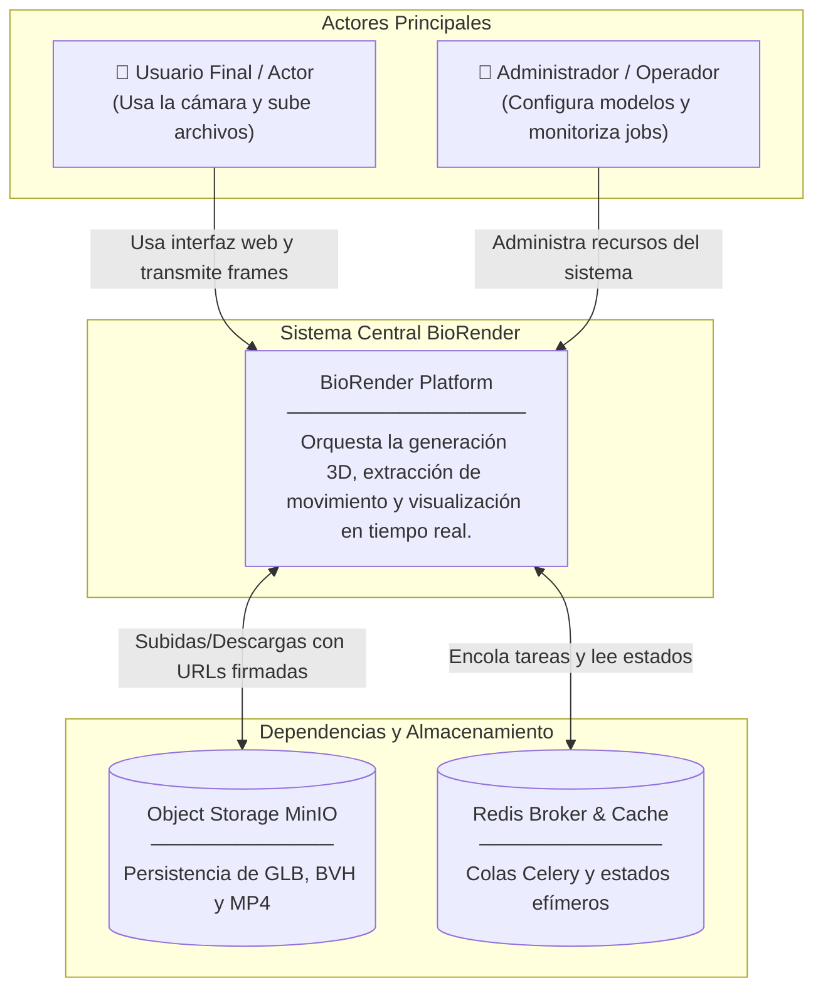
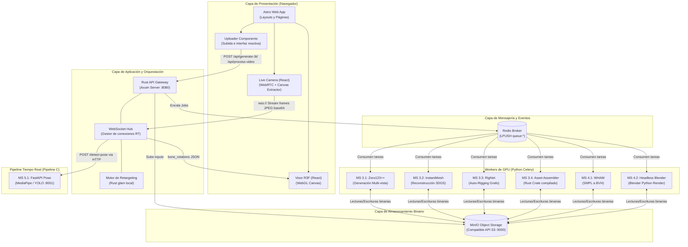
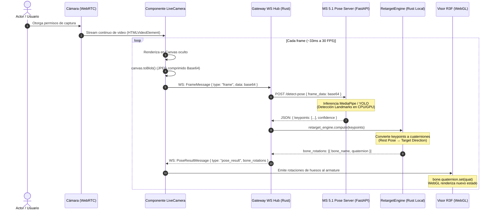
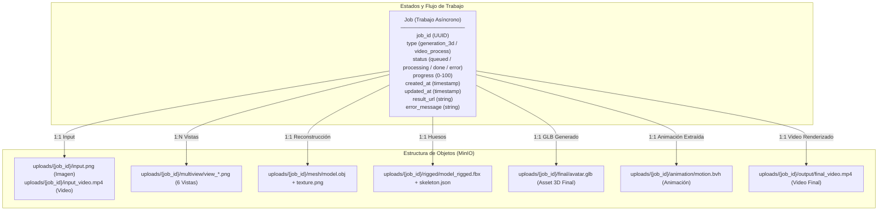
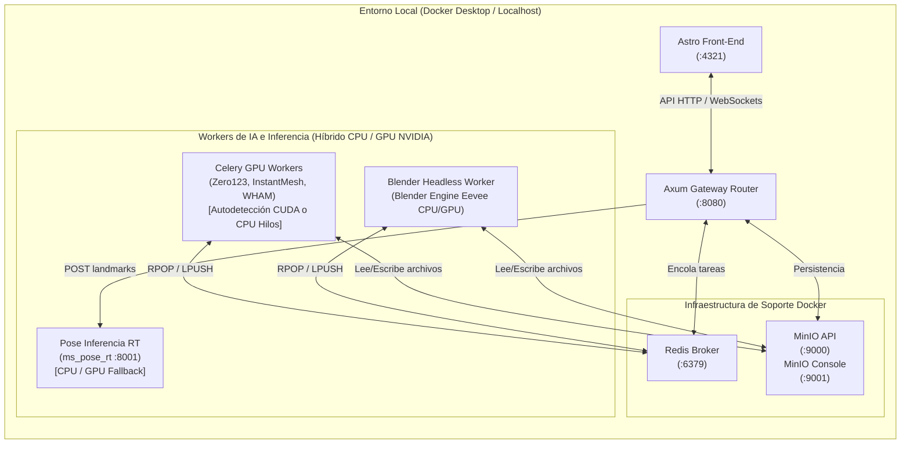

# Arquitectura del Sistema - BioRender

> **Audiencia:** Arquitectos de solución, líderes técnicos, desarrolladores y gerentes de TI.
> **Alcance:** Describe la estructura fundamental del sistema **BioRender**, detallando la interconexión de alto nivel entre componentes, los flujos asíncronos y en tiempo real, el modelo de datos físico, y la topología de red y despliegue sobre contenedores con aceleración por hardware.

---

## 1. Visión General del Sistema (C4 – Nivel Contexto)

El sistema **BioRender** permite a los usuarios interactuar con avatares 3D generados a partir de imágenes, capturar sus movimientos físicos y ver animaciones automáticas tanto en vivo como en diferido.

### Decisiones arquitectónicas clave (Nivel Macro):
*   **Enfoque de Microservicios Desacoplados:** Cada componente de procesamiento computacional pesado corre en su propio contenedor optimizado para GPU, evitando interferir con el Gateway HTTP del sistema.
*   **Comunicación Híbrida:** Uso de HTTP REST clásico para flujos transaccionales y subida de archivos; WebSockets bidireccionales asíncronos para streaming de baja latencia; y arquitectura dirigida por eventos (LPUSH/RPOP) mediante Redis/Celery para tareas GPU en segundo plano.

---

## 2. Componentes Internos (C4 – Nivel Contenedor)

Desglose de la arquitectura de BioRender en sus aplicaciones y capas físicas independientes:

### Flujo de una interacción típica:
1.  **Pipeline Asíncrono (Pipeline A/B):** El navegador sube un archivo $\rightarrow$ El API Gateway (Rust) recibe el binario y lo almacena directamente en MinIO $\rightarrow$ Registra el Job e inserta un evento en Redis $\rightarrow$ El Worker de IA en Celery consume la tarea $\rightarrow$ Procesa el pipeline IA (bajo GPU, o CPU si no hay CUDA activo) $\rightarrow$ Sube los assets finales a MinIO y marca el Job como `done` en Redis.
2.  **Pipeline en Tiempo Real (Pipeline C):** El componente `LiveCamera` captura un stream de cámara web $\rightarrow$ Codifica frames a JPEG Base64 $\rightarrow$ Envía los frames vía WebSocket al Gateway $\rightarrow$ El Gateway delega la detección a `ms_pose_rt` $\rightarrow$ Recibe los keypoints 3D $\rightarrow$ Calcula instantáneamente el retargeting matemático con `RetargetEngine` en Rust $\rightarrow$ Devuelve los cuaterniones al navegador $\rightarrow$ `Viewer3D` rota los huesos del avatar.

> [!NOTE]
> **Bypass de Sandbox de Cámara en Windows**: El diseño del Pipeline C soluciona de raíz la imposibilidad de montar dispositivos USB de cámara físicos (`/dev/video0`) en contenedores Docker corriendo en hosts Windows/WSL2. Al capturar el stream en la Capa de Presentación del cliente, comprimir cada frame y transmitirlo secuencialmente por WebSocket, la infraestructura de contenedores funciona de forma desacoplada y 100% portable.

---

## 3. Flujo de Secuencia (Casos de Uso Complejos)

### 3.1 Flujo de Inferencia y Retargeting en Tiempo Real (Pipeline C)
Este flujo exige una latencia mínima e integra la cámara web, el API Gateway de Rust, el servidor de inferencia Python MediaPipe y el visor en tres dimensiones:

---

## 4. Modelo de Dominio / Entidad-Relación

BioRender opera de forma asíncrona mediante el concepto de **Jobs** y almacena estructuras jerárquicas binarias en MinIO asociadas con identificadores persistidos de forma efímera en Redis.

---

## 5. Arquitectura de Despliegue (Infraestructura)

El despliegue de BioRender utiliza contenedores Docker organizados localmente por `docker-compose` con soporte dinámico de GPU (vía `nvidia-container-toolkit`) y fallback completo a CPU. Esto garantiza la ejecución portable sin comprometer el rendimiento en servidores con aceleración por hardware:

> [!TIP]
> **Optimización de Recursos**: Todos los contenedores de esta topología tienen límites rígidos de memoria (`limits.memory`) configurados en el compose file. Esto garantiza que las cargas concurrentes no desestabilicen el sistema operativo Windows anfitrión y mitiga las fugas de memoria OOM en el backend.

---

## 6. Decisiones Arquitectónicas Relevantes (ADRs Resumidos)

| Decisión Tomada | Alternativas Descartadas | Razón Principal e Histórica |
| :--- | :--- | :--- |
| **Inferencia RT con MediaPipe en CPU (Prototipo MVP)** | YOLOv8-Pose TensorRT, RTMPose | Permite desarrollar, simular y validar el MVP de inmediato en cualquier hardware local sin obligar a la pre-configuración de drivers NVIDIA y librerías CUDA complejas desde la primera fase. |
| **Orquestador Asíncrono de Colas en Redis (Celery)** | RabbitMQ, Apache Kafka | Python cuenta con una integración inmejorable con Celery sobre Redis. Minimiza la fricción de desarrollo al utilizar exactamente las mismas clases de negocio de inferencia profunda. |
| **Retargeting Matemático de Huesos en el Gateway (Rust)** | Calcular retargeting en el Navegador (JavaScript) | Aliviar la carga computacional del dispositivo del cliente (móviles o portátiles de gama media). Rust con la librería `glam` realiza los cálculos vectoriales en $< 0.1ms$ por frame antes de despachar. |
| **Almacenamiento compatible S3 local (MinIO)** | Almacenamiento local en disco rígido montado en carpetas | El uso de la API S3 mediante MinIO garantiza que el sistema sea cloud-native. Migrar a AWS S3 en producción requiere únicamente la edición de variables de entorno del archivo `.env`, sin modificar código. |
| **Ingress Bypass de Cámara por WebSocket (Frontend-Proxy)** | Montaje directo de `/dev/video0` en Docker | Resuelve la restricción técnica de sandboxing de dispositivos USB del host Windows/WSL2 en Docker Desktop de forma nativa e independiente de la plataforma host, logrando máxima portabilidad. |
| **Estrategia Híbrida de Inferencia (CPU/GPU Fallback)** | Contenedores separados exclusivos por hardware | Evita la duplicación y mantenimiento de imágenes Docker diferentes. El microservicio en runtime detecta CUDA (`torch.cuda.is_available()`) y ajusta la complejidad de los pesos y multihilos. |
