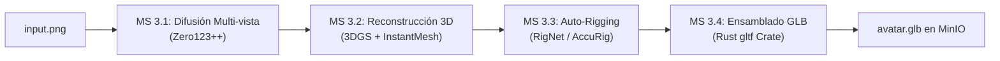
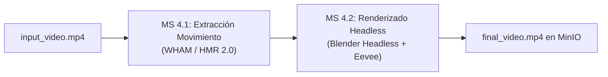

# BioRender - Plan Maestro de Implementación Completo (Microservicios)

> **Propósito.** Este documento define de forma exhaustiva, metódica y estructurada la hoja de ruta de ingeniería para construir la plataforma **BioRender** completa orientada a microservicios. Describe la integración de los flujos asíncronos pesados (Pipeline A: Generación 3D e imágenes a malla; Pipeline B: Retargeting y renderizado de video offline mediante Blender) y la optimización de latencia para el flujo en tiempo real (Pipeline C).
>
> **Persistencia:** Almacenamiento de objetos MinIO (compatible con Amazon S3) para persistencia binaria de modelos (.obj, .fbx, .glb), animaciones (.bvh) y videos (.mp4); Redis para el encolamiento de tareas y el almacenamiento efímero del estado de los trabajos.
>
> **Tooling:** Monorepo con gestores de paquetes `npm` (Frontend), `cargo` (Gateway y microservicio de ensamblado GLB), y `poetry` o entornos virtuales de `pip` (Workers de IA en Python 3.10).

---

## Índice

1. [Convenciones y Nomenclatura](#1-convenciones-y-nomenclatura)
2. [Stack Tecnológico Definitivo (Producción)](#2-stack-tecnologico-definitivo-produccion)
3. [Estructura Objetivo del Repositorio Completo](#3-estructura-objetivo-del-repositorio-completo)
4. [Datos de Referencia (Fixtures & Golden Data)](#4-datos-de-referencia-fixtures-golden-data)
5. **Fase 0** — [Setup e Infraestructura de Soporte](#fase-0--setup-e-infraestructura-de-soporte)
6. **Fase 1** — [Pipeline A: Generación 3D (Offline Asíncrono)](#fase-1--pipeline-a-generacion-3d-offline-asincrono)
7. **Fase 2** — [Pipeline B: Renderizado Offline de Video](#fase-2--pipeline-b-renderizado-offline-de-video)
8. **Fase 3** — [Pipeline C: Optimización e Inferencia en Tiempo Real](#fase-3--pipeline-c-optimizacion-e-inferencia-en-tiempo-real)
9. **Fase 4** — [API Gateway, Orquestación y Colas de Tareas](#fase-4--api-gateway-orquestacion-y-colas-de-tareas)
10. **Fase 5** — [Frontend Integral y Panel de Administración](#fase-5--frontend-integral-y-panel-de-administracion)
11. [Apéndices](#apendices)

---

## 1. Convenciones y Nomenclatura

- **Terminología de Negocio:**
  - **Job:** Tarea asíncrona de larga duración que opera en la GPU (ej: generación 3D, renderizado de video).
  - **Asset 3D:** El personaje completo generado, que contiene geometría texturizada y un esqueleto rigged estándar (.glb).
  - **3D Gaussian Splatting (3DGS):** Representación tridimensional explícita basada en elipses Gaussianas optimizadas por descenso de gradiente.
  - **Rigging:** Proceso cinemático para añadir una jerarquía de huesos articulados a la malla y asociar coeficientes de deformación (skinning weights).
  - **BVH (Biovision Hierarchy):** Formato estándar de captura de movimiento que describe la jerarquía del esqueleto y datos de rotación angular por frame.
  - **SMPL (Skinned Multi-Person Linear Model):** Modelo paramétrico realista del cuerpo humano utilizado para representar poses corporales complejas mediante parámetros de rotación θ y de forma β.
- **Estándares Operativos:**
  - **Aislamiento de GPU:** Los microservicios de GPU pesados se aislarán en contenedores con soporte NVIDIA Container Toolkit (`runtime: nvidia`).
  - **Idempotencia:** Las operaciones de subida y re-ejecución de un Job con el mismo hash de archivo no duplicarán datos en MinIO; en su lugar, actualizarán el registro del Job existente.
  - **Backoff Exponencial:** Todos los clientes (Gateway a MinIO, Workers a Redis) implementarán reintentos con retrasos incrementales.

---

## 2. Stack Tecnológico Definitivo (Producción)

Matriz tecnológica completa para el ecosistema de producción de BioRender:

| Capa / Dominio | Tecnología | Versión | Justificación Técnica |
| :--- | :--- | :--- | :--- |
| **Backend Orquestador** | Rust + Axum | 1.78+ | Manejo de WebSockets a escala, rendimiento inigualable y procesamiento matemático de baja latencia con `glam`. |
| **Microservicios de IA** | Python 3.10+ | 3.10.12 | Versión estable requerida para compatibilidad estricta con PyTorch 2.2+, CUDA 12.x y bibliotecas de inferencia. |
| **Deep Learning Base** | PyTorch | 2.2+ (CUDA 12.x) | Estándar de la industria para ejecución y entrenamiento de modelos de difusión y estimación de pose. |
| **Message Broker** | Redis | 7.x-alpine | Rendimiento ultra alto en memoria para colas de mensajería asíncronas y seguimiento de estados de jobs. |
| **Gestión de Colas** | Celery (Python) | 5.3+ | Framework productor-consumidor robusto y nativo de Python para la distribución de jobs asíncronos en GPU. |
| **Almacenamiento de Objetos** | MinIO | Latest | Object Storage compatible con la API de Amazon S3, idóneo para despliegues auto-alojados (on-premise / local) con velocidad sobresaliente. |
| **Modelos de Reconstrucción 3D** | InstantMesh / LGM | - | Modelos feed-forward de imagen a malla en menos de 10 segundos, superando los largos tiempos de NeRF tradicionales. |
| **Modelos de Retargeting de Video** | WHAM / HMR 2.0 | - | Estimación robusta y consistente en el tiempo de parámetros del cuerpo humano (SMPL) incluso bajo oclusiones complejas. |
| **Auto-Rigging** | RigNet | - | Red neuronal basada en grafos (GCN) para predecir joints y calcular skinning weights precisos. |
| **Ensamblador GLB** | Rust + `gltf` crate | 1.4+ | Empaquetado binario ultrarrápido y seguro de datos tridimensionales, texturas y skins en archivos `.glb`. |
| **Visualización en Navegador** | Astro + React + R3F | Astro 5, React 19 | Arquitectura modular de islas interactivas de alto rendimiento con renderizado WebGL fluido. |
| **Renderizado Headless** | Blender Headless | 4.1+ (Python bpy) | Motor de renderizado profesional (Eevee) ejecutable en la GPU mediante consola para exportar videos .mp4 definitivos de excelente calidad visual. |

---

## 3. Estructura Objetivo del Repositorio Completo

Monorepo extendido para BioRender en fase de producción:

```text
BioRender/
│
├── docker-compose.yml             # Orquestación de infraestructura local y workers
├── .env                           # Variables de entorno unificadas de producción
├── .gitignore
├── pyproject.toml                 # Configuración de formateo global Python (Ruff)
│
├── frontend/                      # Capa 1: Astro + React + R3F + Tailwind CSS v4
│   ├── src/
│   │   ├── components/
│   │   │   ├── react/
│   │   │   │   ├── ImageUploader.tsx   # Micromódulo 1.1 (Carga Imagen 3D)
│   │   │   │   ├── VideoUploader.tsx   # Micromódulo 1.2 (Carga/Graba Video Offline)
│   │   │   │   ├── LiveCamera.tsx      # Micromódulo 1.3 (Stream RT WebRTC)
│   │   │   │   ├── Viewer3D.tsx        # Renderizador R3F (WebGL)
│   │   │   │   └── VideoPlayer.tsx     # Reproductor MP4 de MinIO
│   │   │   └── astro/
│   │   └── pages/
│   │       └── index.astro             # Landing page modular "BioRender Punk"
│   └── public/
│       ├── fonts/
│       └── models/                     # Cache de GLB de referencia
│
├── gateway/                       # Capa 2: Rust API Gateway & WebSocket Hub
│   ├── Cargo.toml
│   └── src/
│       ├── main.rs
│       ├── routes/
│       │   ├── generate_3d.rs          # POST /api/generate-3d (Encola tarea)
│       │   ├── process_video.rs        # POST /api/process-video (Encola tarea)
│       │   ├── jobs.rs                 # GET /api/jobs/{job_id} (Polling)
│       │   └── ws_live.rs              # WebSocket de inferencia RT (Pipeline C)
│       └── services/
│           ├── redis_queue.rs          # Productor Redis (LPUSH)
│           ├── job_tracker.rs          # Transiciones de estado de Jobs
│           └── minio_client.rs         # Cliente de S3 (Upload/Presigned URLs)
│
└── services/                      # Capas 3, 4 y 5: Microservicios IA & Workers
    ├── generation_3d/             # Pipeline A (Imágenes a GLB Rigged)
    │   ├── ms_multiview/          # MS 3.1: Zero123++ Worker (Celery)
    │   ├── ms_reconstruction/     # MS 3.2: 3DGS & InstantMesh Worker (Celery)
    │   ├── ms_rigging/            # MS 3.3: RigNet/AccuRig Worker (Celery)
    │   └── ms_asset_assembly/     # MS 3.4: Ensamblador GLTF/GLB (Rust Crate)
    │
    ├── video_render/              # Pipeline B (Video a MP4 Animado)
    │   ├── ms_motion_extract/     # MS 4.1: WHAM / SMPL to BVH Worker (Celery)
    │   └── ms_headless_render/    # MS 4.2: Blender Headless Eevee (Celery)
    │
    └── realtime/                  # Pipeline C (Inferencia RT WebRTC)
        └── ms_pose_rt/            # MS 5.1: MediaPipe/YOLO-Pose Server (FastAPI)
```

---

## 4. Datos de Referencia (Fixtures & Golden Data)

Aseguramos la trazabilidad de los flujos asíncronos mediante especificaciones de entrada/salida.

### Flujo de Golden Data en Pipeline A (Generación 3D):
*   **Input:** Imagen PNG de 512x512 de un personaje humanoid frontal (`input.png`).
*   **Output Intermedio (MS 3.1):** Arreglo de 6 imágenes correspondientes a vistas en ángulos azimutales de $0^\circ, 60^\circ, 120^\circ, 180^\circ, 240^\circ, 300^\circ$.
*   **Output Geométrico (MS 3.2):** Archivo `model.obj` (malla con $\approx 40,000$ caras) y `texture.png` (textura difusa horneada).
*   **Output Cinemático (MS 3.3):** Archivo `skeleton.json` que detalla los 25 joints alineados con las articulaciones anatómicas del personaje.
*   **Output Final (MS 3.4):** Archivo `avatar.glb` empaquetado binario, autovalidado mediante el validador oficial de Khronos Group.

### Flujo de Golden Data en Pipeline B (Procesamiento de Video):
*   **Input:** Archivo `video.mp4` (H.264, 30 FPS, 5 segundos) que muestra a un actor levantando ambos brazos.
*   **Output Animación (MS 4.1):** Archivo `motion.bvh` que contiene 150 frames de datos rotacionales para un esqueleto humanoid estándar de 25 huesos.
*   **Output Renderizado (MS 4.2):** Archivo `output_video.mp4` (1920x1080, 30 FPS) donde el personaje generado en el Pipeline A realiza los movimientos del actor con fondo iluminado por Eevee en Blender.

---

## 5. Fases de Ejecución

### Fase 0 — Setup e Infraestructura de Soporte

**Macro-objetivo:** Desplegar y certificar la infraestructura que dará soporte a los pipelines complejos (Redis, MinIO), estructurando variables de entorno y verificando la comunicación local.

#### Sub Fase 0.1 — Despliegue de Infraestructura Básica
*   **Micro-objetivo:** Establecer almacenamiento persistente y colas operativas de Redis/MinIO.
*   **AC:** Health checks de MinIO y Redis pasan limpios desde contenedores aislados.

##### T0.1.1 — Orquestación Docker Compose y S3 Setup
- **Entregable:** Contenedores corriendo y buckets inicializados.
- **Acciones:**
  - Crear archivo `docker-compose.yml` que orqueste la infraestructura global: `redis:7-alpine`, `minio/minio:latest`.
  - Crear script automático en bash/python (`scripts/setup_minio.py`) que verifique la conectividad de la API S3 e inicialice el bucket principal `biorender-assets` con políticas públicas de descarga.
- **AC:** Scripts de verificación de puertos reportan código de estado exitoso.

##### T0.1.2 — Setup de Configuración del Monorepo (.env)
- **Entregable:** Archivo `.env` de producción unificado.
- **Acciones:**
  - Definir las variables de acceso del S3, endpoints de los workers, conexiones de base de datos en Redis y configuraciones de CUDA.
- **AC:** Las variables de entorno son cargadas y validadas por los submódulos en tiempo de compilación/arranque.

---

### Fase 1 — Pipeline A: Generación 3D (Offline Asíncrono)

**Macro-objetivo:** Implementar la cadena completa de transformación de una imagen 2D a un asset 3D completamente animable en formato `.glb`.



#### Sub Fase 1.1 — Generación Multi-vista (MS 3.1)
*   **Micro-objetivo:** Inferencia del modelo de difusión Zero123++ en worker Celery con soporte CUDA.
*   **AC:** Generación estable de 6 vistas a partir de la imagen de entrada en $< 4$ segundos en GPU.

##### T1.1.1 — Implementación del Worker Zero123++
- **Entregable:** Contenedor de Celery Worker en Python que consuma tareas de la cola `queue:generation`.
- **Acciones:**
  - Descargar la imagen de entrada desde MinIO.
  - Ejecutar inferencia de difusión con `diffusers` y Zero123++ en GPU (CUDA).
  - Subir las vistas generadas a `biorender-assets/{job_id}/multiview/view_{0-5}.png`.
- **AC:** Pruebas unitarias de inferencia con imágenes del dataset canónico pasan sin errores numéricos.

#### Sub Fase 1.2 — Reconstrucción 3D y Extracción de Malla (MS 3.2)
*   **Micro-objetivo:** Reconstrucción tridimensional mediante 3D Gaussian Splatting / InstantMesh feed-forward.
*   **AC:** Malla texturizada (`model.obj` + `texture.png`) subida a MinIO en menos de 10 segundos de procesamiento de GPU.

##### T1.2.1 — Implementación del Reconstructor Feed-forward
- **Entregable:** Worker Celery en Python para procesamiento tridimensional.
- **Acciones:**
  - Descargar las vistas multi-ángulo de la etapa anterior de MinIO.
  - Ejecutar reconstrucción mediante InstantMesh optimizado para GPU.
  - Extraer malla en formato OBJ mediante Marching Cubes y generar el atlas de texturas UV.
  - Guardar resultados en MinIO: `{job_id}/mesh/model.obj` y `{job_id}/mesh/texture.png`.
- **AC:** Archivo OBJ generado es analizado estructuralmente y cuenta con mapeo UV válido.

#### Sub Fase 1.3 — Auto-Rigging Neuronal (MS 3.3)
*   **Micro-objetivo:** Generación del esqueleto adaptativo y skinning weights automáticos.
- **AC:** Exportación de malla rigged en formato FBX con pesos de piel válidos y jerarquía estándar de 25 huesos humanoid.

##### T1.3.1 — Setup de RigNet/AccuRig
- **Entregable:** Worker Celery especializado en rigging geométrico.
- **Acciones:**
  - Analizar topología del OBJ descargado de MinIO.
  - Predecir las posiciones tridimensionales de los 25 joints clave y estimar la jerarquía de huesos.
  - Calcular la influencia de cada hueso sobre los vértices (skinning weights) usando Linear Blend Skinning (LBS).
  - Exportar el modelo rigged a `{job_id}/rigged/model_rigged.fbx` y el esqueleto a `{job_id}/rigged/skeleton.json`.
- **AC:** Todos los pesos de piel suman exactamente 1.0 por cada vértice analizado en las pruebas unitarias.

#### Sub Fase 1.4 — Ensamblador de Assets 3D (MS 3.4)
*   **Micro-objetivo:** Convertir el modelo rigged FBX y textura a un archivo binario `.glb` auto-contenido mediante un microservicio de alto rendimiento escrito en Rust.
*   **AC:** Generación de archivo `.glb` compacto e incrustado listo para ser animado directamente en R3F.

##### T1.4.1 — Implementación del Serializador GLTF en Rust
- **Entregable:** Aplicación compilada en Rust que consume la cola de empaquetado final.
- **Acciones:**
  - Descargar archivo FBX, textura base y `skeleton.json` de MinIO.
  - Parsear datos del FBX, re-indexar buffers de geometría y empaquetar coordenadas de vértices, pesos de skin y joints en los buffers binarios de GLTF.
  - Incrustar la imagen de textura como búfer de imagen PNG dentro del contenedor binario.
  - Serializar y exportar archivo final a `{job_id}/final/avatar.glb`.
- **AC:** El archivo GLB generado pasa con éxito el validador oficial de Khronos GLTF y renderiza correctamente en Three.js.

---

### Fase 2 — Pipeline B: Renderizado Offline de Video

**Macro-objetivo:** Implementar el pipeline que procesa un video humano cargado por el usuario, extrae las poses corporales y renderiza de forma headless una animación limpia sobre el avatar generado.



#### Sub Fase 2.1 — Extracción de Movimiento Humano (MS 4.1)
*   **Micro-objetivo:** Extracción frame a frame de la pose tridimensional (SMPL) y su exportación a un formato de animación reusable (`.bvh`).
*   **AC:** Generación de archivo `motion.bvh` estructurado de forma idéntica al esqueleto estándar humanoid en $< 15$ segundos en GPU.

##### T2.1.1 — Worker de Extracción WHAM/HMR
- **Entregable:** Contenedor de Celery Worker en Python que consuma de `queue:motion`.
- **Acciones:**
  - Decodificar los frames del video cargado (`.mp4` o `.webm`) a 30 FPS usando OpenCV.
  - Detectar actores en la escena mediante YOLOv8-Pose y rastrear la pose tridimensional usando WHAM / HMR 2.0.
  - Convertir los parámetros de pose SMPL extraídos frame a frame a rotaciones angulares e interpolar joints al esqueleto canónico de 25 huesos.
  - Exportar el flujo de animación a `{job_id}/animation/motion.bvh`.
- **AC:** El archivo BVH generado es legible por parsers estándar de animación y contiene datos continuos sin saltos abruptos.

#### Sub Fase 2.2 — Blender Headless Rendering (MS 4.2)
*   **Micro-objetivo:** Scripting de Blender y horneado de video en GPU a través de consola.
*   **AC:** Video final `.mp4` codificado en H.264 y guardado de manera asíncrona en MinIO.

##### T2.2.1 — Integración de Blender Headless Eevee
- **Entregable:** Contenedor Docker especializado de GPU que incluye Blender 4.1 headless y la biblioteca Celery.
- **Acciones:**
  - Descargar el `.glb` generado en el Pipeline A y el `.bvh` animado del Pipeline B.
  - Inicializar escena Blender por script Python (`bpy`), cargar el avatar e importar la animación `.bvh`.
  - Crear restricciones de retargeting (`COPY_ROTATION`) para copiar los movimientos del esqueleto del BVH sobre los huesos del avatar en la escena de Blender.
  - Configurar cámara, luces de escena Eevee y exportar los frames renderizados a un archivo codificado `.mp4` usando FFmpeg interno.
  - Subir el archivo final a `{job_id}/output/final_video.mp4`.
- **AC:** Ejecución de renderizado headless finaliza con éxito en GPU y genera un video MP4 legible de alta fidelidad.

---

### Fase 3 — Pipeline C: Optimización e Inferencia en Tiempo Real

**Macro-objetivo:** Optimizar el microservicio en tiempo real del MVP para soportar inferencia distribuida opcional y retargeting cinemático avanzado en producción, garantizando latencias ultra-bajas constantes.

#### Sub Fase 3.1 — Inferencia en Tiempo Real de Alta Concurrencia
*   **Micro-objetivo:** Integración alternativa de YOLOv8-Pose / RTMPose en GPU para capturas RT robustas.
*   **AC:** Tasa de inferencia de pose sostenida a $\ge 60$ FPS con $< 5ms$ de procesamiento por frame.

##### T3.1.1 — Migración a YOLOv8-Pose RT
- **Entregable:** Módulo de inferencia en Python con FastAPI optimizado con TensorRT o CUDA.
- **Acciones:**
  - Implementar pipeline de inferencia utilizando YOLOv8-Pose (modelo nano/small) optimizado con TensorRT.
  - Diseñar clasificador interno de oclusiones para mitigar la inestabilidad de las extremidades cuando el actor no esté completamente visible.
- **AC:** Tasa de FPS promedio sostenida por encima del estándar en pruebas de estrés concurrentes.

---

### Fase 4 — API Gateway, Orquestación y Colas de Tareas

**Macro-objetivo:** Refinar el API Gateway central en Rust para orquestar de forma segura las colas de Redis, subir archivos directamente a MinIO mediante URLs firmadas temporalmente y monitorizar transiciones de jobs asíncronos.

#### Sub Fase 4.1 — Orquestación Robusta de Colas y S3 en Rust
*   **Micro-objetivo:** Gateway tolerante a fallos con flujos de polling directos a Redis.
*   **AC:** Flujos asíncronos REST encolan correctamente y reportan estados consistentes.

##### T4.1.1 — Orquestador de Jobs en Redis
- **Entregable:** Módulo de Gateway Rust `redis_queue.rs` y `job_tracker.rs`.
- **Acciones:**
  - Implementar encolamiento seguro de payloads JSON usando `redis::AsyncCommands`.
  - Implementar transiciones estrictas del estado del Job (`queued` $\rightarrow$ `processing` $\rightarrow$ `done` / `error`).
- **AC:** Bloqueos en Redis se recuperan automáticamente y conexiones caídas se restablecen de forma transparente al cliente.

##### T4.1.2 — Presigned URLs para MinIO
- **Entregable:** Subidas directas de archivos grandes optimizadas.
- **Acciones:**
  - Generar URLs firmadas de descarga (`presigned GET URL`) con caducidad limitada para que el navegador descargue directamente los videos `.mp4` y modelos `.glb` desde MinIO sin saturar el Gateway.
- **AC:** Peticiones HTTP directas usando las URLs firmadas expiran exactamente en el tiempo parametrizado y retornan los binarios correctos.

---

### Fase 5 — Frontend Integral y Panel de Administración

**Macro-objetivo:** Unificar la interfaz del frontend bajo el diseño visual "BioRender Punk", integrando barras de progreso reactivas para los Jobs y paneles para comparar el video de entrada con el avatar 3D en tiempo real.

#### Sub Fase 5.1 — UI Unificada y Visualizaciones Modulares
*   **Micro-objetivo:** Frontend Astro pulido y robusto de alta interacción visual.
*   **AC:** El monorepo compila de forma consolidada e integra los tres pipelines en una única UI de alta fidelidad.

##### T5.1.1 — Implementación del ImageUploader y VideoUploader Modulares
- **Entregable:** Componentes React pulidos integrados en Astro.
- **Acciones:**
  - Diseñar el drag-and-drop con respuesta reactiva visual en escala de grises.
  - Implementar polling continuo inteligente con retroceso exponencial para consultar `GET /api/jobs/{id}` y actualizar las barras de progreso del pipeline.
- **AC:** Las barras de progreso reflejan fielmente las transiciones del backend sin saturar de peticiones HTTP el servidor.

##### T5.1.2 — Integración de Reproducción E2E
- **Entregable:** Panel lateral doble en el frontend.
- **Acciones:**
  - Posicionar a la izquierda el visor WebGL de R3F y a la derecha el reproductor de video `.mp4` cargado desde las URLs temporales de MinIO.
- **AC:** Ambos componentes funcionan de forma armónica e interactiva en pantallas de alta resolución y móviles.

---

## 6. Apéndices

### Apéndice A — Definition of Done (DoD) Global en Producción

1.  **Linters e Inferencia**: Todos los formateadores (`ruff`, `eslint`, `cargo fmt`) y detectores de tipo estáticos pasan limpios al 100%.
2.  **Pruebas unitarias y de integración**: Cobertura de tests del Gateway Rust y de los módulos IA en Python $\ge 85\%$.
3.  **Seguridad S3**: Ningún archivo binario se sirve directamente a través del Gateway; siempre se emplean `Presigned URLs` firmadas con firmas criptográficas de MinIO/S3.
4.  **Aislamiento de Recursos**: Todos los contenedores de GPU limitan su uso de VRAM y memoria para evitar fallos por Out-Of-Memory (OOM) en entornos de desarrollo local.

### Apéndice B — Gestión de Riesgos Técnicos y Mitigaciones

| Riesgo Técnico Identificado | Impacto | Mitigación |
| :--- | :--- | :--- |
| **Pérdida de frames en WebSocket RT** | Alto | Implementación de descarte proactivo de frames antiguos en el cliente si la latencia del canal supera los 80ms. |
| **Inestabilidad del auto-rigging neuronal** | Medio | Inclusión de un script de fallback heurístico en Blender basado en distancias euclidianas simples si RigNet falla. |
| **Alto consumo de memoria en la inferencia de 3DGS** | Alto | Uso de modelos alternativos ligeros (InstantMesh) con limitación de resolución a 256 de forma predeterminada. |
